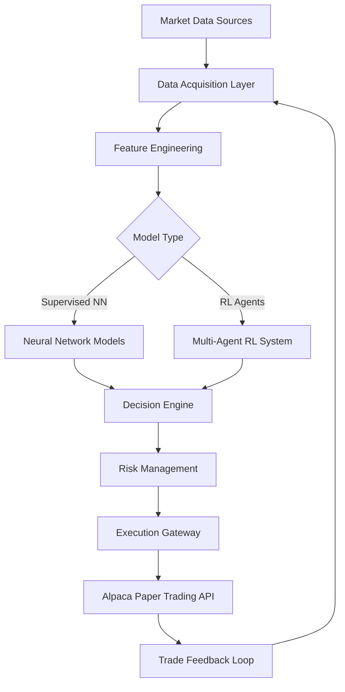

# Consolidated Documentation: Core Architecture & System Design

**Document Version:** 2.1 - Consolidated  
**Last Updated:** October 9, 2025  
**Status:** Production Reference  
**Consolidates:** systemPatterns.md, techContext.md, productContext.md, rl_system_architecture.md, asset_id_embedding_strategy.md

---

## Table of Contents

1. [Project Overview](#project-overview)
2. [System Architecture](#system-architecture)
3. [Directory Structure](#directory-structure)
4. [Core Components](#core-components)
5. [Technology Stack](#technology-stack)
6. [Asset ID Embedding Strategy](#asset-id-embedding-strategy)
7. [RL System Architecture](#rl-system-architecture)
8. [Architecture Patterns](#architecture-patterns)
9. [Environment Specifications](#environment-specifications)

---

## 1. Project Overview

### Project Purpose
An AI-powered trading system that operates exclusively on a local machine, directly connected to a paper trading account via the Alpaca API. The system leverages custom Neural Networks with multi-agent Reinforcement Learning to monitor live market data and generate trading signals.

**Strategic Evolution:**
- **Phase 1 (Completed):** LLM/LoRA-based approach (pivoted away due to high loss and modest F1 scores)
- **Phase 2 (Current):** Custom Neural Network supervised learning baseline
- **Phase 3 (Future):** Multi-agent Reinforcement Learning system

### Core Objectives
- **Local System Operation:** All operations performed locally for security, privacy, and control
- **Profit-Optimized Trading:** Automated trade execution based on AI-generated signals
- **Comprehensive Data Integration:** Market data, sentiment analysis, technical indicators
- **Adaptive Learning:** Continuous improvement through trade outcomes
- **Risk Management:** Stop-loss/take-profit rules and dynamic position sizing
- **Backtesting & Evaluation:** Rigorous strategy validation before deployment

### Phase 3 Stage Progress (as of 2025-10-09)

| Stage | Focus | Status | Baseline / Evidence |
|-------|-------|--------|----------------------|
| Stage 1 | Exploration recovery (actor gain 0.1, entropy schedule, reward normalization disabled) | ✅ Complete | `analysis/validate_exploration_fix.py`; smoke requirement: action entropy ≥1.3 with ≥4 actions per 120-step window |
| Stage 2 | Professional reward stack (realized-only PnL, exit multipliers, pyramiding gates) | ✅ Complete | 3 k-step benchmark: Sharpe +0.563, win rate 64.5%, max DD 0.45% |
| Stage 3 | Anti-collapse safeguards (diversity bonus 0.07, action repeat penalty 0.05, SELL mask audit) | ✅ Complete | `tests/test_reward_shaper.py` 42/42 pass (2025-10-09) |
| Stage 4 | Telemetry + Stage 5 runner (entropy guard, voluntary trade metrics) | ✅ Complete | `scripts/run_phase3_stage5_validation.py` emits `policy_action_entropy_mean`, `voluntary_trade_rate`, sanitizer deltas |
| Stage 5 | Short retrain (5–10 k timesteps per seed) + telemetry diffing | 🚧 Pending | Command staged; success gates: entropy ≥0.20, voluntary trade ≥10%, sanitizer delta <15 pp |

---

## 2. System Architecture

### High-Level System Flow



### Layer Architecture

#### Data Layer
- Historical market data (Parquet storage)
- Real-time market feeds (Alpaca API)
- Sentiment analysis (FinBERT)
- Macro indicators and regime features

#### Feature Layer
- Technical indicators (14 TIs)
- Sentiment scores (normalized [0,1])
- Temporal features (day of week cyclical encoding)
- Asset ID embeddings for multi-symbol training

#### Model Layer
- **Supervised Models:** MLP, LSTM+Attention, GRU+Attention, CNN-LSTM
- **RL System (Future):** Three-tier agent hierarchy
  - Tier 1: Master Agent (Portfolio Manager)
  - Tier 2: Symbol Agents (143 independent agents)
  - Tier 3: Shared Feature Encoders

#### Decision Layer
- Signal generation and validation
- Position management
- Risk overlays and constraints

#### Execution Layer
- Order routing (Alpaca API)
- Transaction cost modeling
- Trade logging and reconciliation

---

## 3. Directory Structure

```
TradingBotAI/
├── core/                           # Core application logic
│   ├── data_preparation_nn.py      # NN data preparation pipeline
│   ├── decision_engine.py          # Strategy execution engine
│   ├── hist_data_loader.py         # Historical data fetching
│   ├── historical_context.py       # Indicator calculation
│   ├── news_sentiment.py           # Sentiment analysis (FinBERT)
│   ├── realtime_handler.py         # Real-time data retrieval
│   ├── db_models.py                # SQLAlchemy database models
│   ├── web_interface.py            # Dashboard backend
│   ├── feature_calculator.py       # Technical indicator calculations
│   │
│   ├── models/                     # Neural network architectures
│   │   └── nn_architectures.py     # MLP, LSTM, GRU, CNN-LSTM definitions
│   │
│   ├── experiment_management/      # MLflow experiment tracking
│   │   ├── config_manager.py       # YAML configuration management
│   │   ├── enhanced_logging.py     # Comprehensive MLflow logging
│   │   ├── experiment_organizer.py # Experiment naming and tagging
│   │   └── reporting.py            # Automated report generation
│   │
│   ├── backtesting/                # Backtesting engine
│   │   ├── engine.py               # Main backtesting orchestrator
│   │   ├── data.py                 # Data feed management
│   │   ├── metrics.py              # Performance metric calculations
│   │   └── ...
│   │
│   ├── strategies/                 # Trading strategies
│   │   └── supervised_nn_strategy.py # NN-based trading strategy
│   │
│   └── rl/                         # Reinforcement Learning (Future)
│       ├── trading_env.py          # RL environment (Gymnasium API)
│       ├── vector_env.py           # Vectorized parallel environments
│       └── ...
│
├── training/                       # Training infrastructure
│   ├── train_nn_model.py           # Main NN training script
│   ├── run_hpo.py                  # Hyperparameter optimization
│   ├── run_hpo_quick_start.py      # Simplified HPO interface
│   ├── pretrain_shared_encoder.py  # Encoder pre-training (RL)
│   │
│   ├── config_templates/           # Configuration files
│   │   ├── mlp_baseline.yaml
│   │   ├── lstm_baseline.yaml
│   │   ├── gru_baseline.yaml
│   │   ├── cnn_lstm_baseline.yaml
│   │   ├── hpo_example.yaml
│   │   └── ...
│   │
│   └── adapter_runs/               # Legacy LLM/LoRA artifacts
│
├── models/                         # Model artifacts
│   ├── hpo_derived/                # HPO-optimized checkpoints
│   │   ├── mlp_trial72.pt
│   │   ├── lstm_trial62.pt
│   │   └── gru_trial93.pt
│   ├── scalers.joblib              # Feature scalers
│   └── ...
│
├── data/                           # Data storage
│   ├── historical/                 # Historical market data (Parquet)
│   │   └── {SYMBOL}/
│   │       └── 1Hour/
│   │           └── data.parquet
│   ├── sentiment/                  # Sentiment analysis outputs
│   │   └── {SYMBOL}/
│   │       └── daily_sentiment.parquet
│   ├── training_data_v2_final/     # Production training dataset
│   │   ├── train_X.npy
│   │   ├── train_y.npy
│   │   ├── train_asset_ids.npy
│   │   ├── scalers.joblib
│   │   └── metadata.json
│   └── prepared_training/          # Intermediate data artifacts
│
├── scripts/                        # Utility and execution scripts
│   ├── run_baseline_training_campaign.py
│   ├── backtest_hpo_production_models.py
│   ├── evaluate_hpo_models_on_test.py
│   ├── generate_combined_training_data.py
│   └── ...
│
├── config/                         # Configuration files
│   ├── symbols.json                # Tradable instruments (143 symbols)
│   ├── asset_id_mapping.json       # Symbol-to-integer ID mapping
│   └── ...
│
├── utils/                          # Utility modules
│   ├── db_setup.py                 # Database connection
│   ├── account_manager.py          # Account balance tracking
│   ├── gpu_utils.py                # GPU optimization helpers
│   └── ...
│
├── backtesting/results/            # Backtesting outputs
│   └── full_campaign/              # Full backtest results
│
├── reports/                        # Analysis and evaluation reports
│   └── phase4/
│       ├── test_set_evaluation/
│       └── ...
│
├── mlruns/                         # MLflow experiment tracking
├── hpo_studies/                    # Optuna study databases
├── logs/                           # Application logs
├── memory-bank/                    # Project documentation
├── trading_bot.db                  # SQLite database
├── Credential.env                  # API credentials
└── requirements.txt                # Python dependencies
```

---

## 4. Core Components

### 4.1 Data Acquisition

**Historical Data Loader (`core/hist_data_loader.py`)**
- Fetches historical bar data (1-hour intervals) from Alpaca API
- Handles pagination and rate limiting
- Saves to Parquet: `data/historical/{SYMBOL}/1Hour/data.parquet`
- Includes OHLCV data + VWAP

**News Sentiment Processor (`core/news_sentiment.py`)**
- **Model:** FinBERT (`ProsusAI/finbert`)
- Concurrent processing with ThreadPoolExecutor
- Dynamic batch sizing (16 for GPU, 4 for CPU)
- Parquet-based caching: `data/sentiment/{SYMBOL}/daily_sentiment.parquet`
- Outputs: `date`, `sentiment_score` [0,1], `news_count`, `model_used`
- API rate limiting (100ms delays)

**Feature Calculator (`core/feature_calculator.py`)**
- **14 Technical Indicators:**
  - Trend: SMA_10, SMA_20, MACD_line, MACD_signal, MACD_hist
  - Momentum: RSI_14, Stoch_K, Stoch_D
  - Trend Strength: ADX_14
  - Volatility: ATR_14, BB_bandwidth
  - Volume: OBV, Volume_SMA_20
  - Returns: 1h_return
- **2 Temporal Features:** DayOfWeek_sin, DayOfWeek_cos
- All indicators stored in historical Parquet files

### 4.2 Data Preparation

**NN Data Preparer (`core/data_preparation_nn.py`)**

**Key Features:**
- Multi-symbol processing (143 symbols)
- 23-feature input: 14 TIs + 2 temporal + 1 sentiment + 6 OHLCV
- 24-hour lookback window (configurable)
- 8-hour prediction horizon
- Profit target: +2.5% (previously +5%, reverted to +5% for current production)
- Stop loss: -2%

**Processing Pipeline:**
1. **Data Loading:** Loads Parquet files with caching
2. **Feature Selection:** Configurable feature subset
3. **Label Generation:** Forward-looking profit/stop-loss logic
4. **Sequence Creation:** Sliding window approach
5. **Scaling:** StandardScaler (fit on training only)
6. **Data Splitting:** 70/15/15 train/val/test (temporal)
7. **Sample Weighting:** Class imbalance handling

**Output Format:**
```python
{
    'train': {
        'X': np.ndarray,  # (n_samples, 24, 23)
        'y': np.ndarray,  # (n_samples,) binary labels
        'asset_ids': np.ndarray,  # (n_samples,)
        'sample_weights': np.ndarray  # (n_samples,)
    },
    'val': {...},
    'test': {...},
    'scalers': dict,
    'asset_id_map': dict  # {symbol: integer_id}
}
```

### 4.3 Neural Network Models

**Model Factory (`core/models/nn_architectures.py`)**

**Supported Architectures:**

1. **MLP (Multi-Layer Perceptron)**
   - Purpose: Baseline feedforward architecture
   - Layers: 2-3 hidden layers [256, 128, 64]
   - Regularization: Dropout, Batch Normalization

2. **LSTM with Self-Attention**
   - Purpose: Primary recurrent model
   - LSTM layers: 1-2 (64-128 hidden units)
   - Attention mechanism: Multi-head self-attention
   - Regularization: Layer Normalization, Dropout

3. **GRU with Self-Attention**
   - Purpose: Alternative recurrent model (lighter than LSTM)
   - GRU layers: 1-2 (64-128 hidden units)
   - Similar attention and regularization as LSTM

4. **CNN-LSTM Hybrid**
   - Purpose: Local feature extraction + temporal modeling
   - CNN: 1-2 layers (32-64 filters, kernel 3-5)
   - LSTM: 1-2 layers following CNN
   - Batch Normalization after CNN

**Common Features:**
- Asset ID embedding (8-16 dimensions)
- Dropout (0.2-0.5)
- Binary classification output (sigmoid)
- PyTorch implementation

**Model Creation:**
```python
from core.models import create_model

model = create_model({
    'model_type': 'lstm_attention',
    'n_features': 23,
    'num_assets': 143,
    'lookback_window': 24,
    'asset_embedding_dim': 8,
    'lstm_hidden_units': 128,
    'attention_dim': 64,
    'dropout_rate': 0.3
})
```

### 4.4 Training Infrastructure

**Main Training Script (`training/train_nn_model.py`)**

**Features:**
- CLI and YAML configuration
- Dynamic model creation
- GPU optimization integration
- Multiple loss functions (Focal Loss, Weighted BCE)
- Optimizers: AdamW (primary), Adam
- LR scheduling: ReduceLROnPlateau, CosineAnnealing
- Early stopping (configurable patience)
- Comprehensive metric tracking
- MLflow integration
- Enhanced file naming with metadata

**Training Loop:**
```python
for epoch in range(num_epochs):
    # Training step
    train_loss, train_metrics = trainer.train_epoch()
    
    # Validation step
    val_loss, val_metrics = trainer.validate()
    
    # Learning rate scheduling
    scheduler.step(val_metrics['f1'])
    
    # Early stopping check
    if early_stopping.should_stop(val_metrics['f1']):
        break
    
    # Model checkpointing
    if val_metrics['f1'] > best_f1:
        save_checkpoint(model, f'epoch{epoch:03d}_{model_type}_f1{val_metrics["f1"]:.4f}_{timestamp}.pt')
```

**HPO Framework (`training/run_hpo.py`)**

**Technology:** Optuna 4.3.0

**Features:**
- Model-specific search spaces (MLP, LSTM, GRU, CNN-LSTM)
- Pruning support (Median, Hyperband)
- MLflow trial logging
- SQLite study persistence
- Parameter importance analysis

**Search Space Categories:**
- Model architecture hyperparameters
- Optimizer hyperparameters (learning rate, weight decay)
- Training hyperparameters (dropout, batch size)
- Loss function parameters (focal alpha/gamma)
- LR scheduler parameters

### 4.5 Backtesting Engine

**Core Engine (`core/backtesting/engine.py`)**

**Features:**
- Event-driven bar playback
- Realistic cost modeling (0.10% commission, 5 bps slippage)
- Portfolio tracking with position management
- Configurable holding periods
- Walk-forward evaluation support
- MLflow integration for results logging

**Strategy Integration (`core/strategies/supervised_nn_strategy.py`)**

**Capabilities:**
- Model and scaler loading
- Feature sequence preparation
- Model inference at each bar
- Action generation: BUY, SELL, HOLD
- Position management (entry/exit logic)
- Risk parameter enforcement

**Advanced Metrics (`core/backtesting/metrics.py`)**
- **Risk-Adjusted:** Sharpe, Sortino, Calmar ratios
- **Trade Performance:** Profit factor, win rate, avg PnL
- **Signal Quality:** Precision, recall, F1-score for BUY signals
- **Threshold Optimization:** F1-score maximization across threshold ranges

### 4.6 Experiment Management

**Configuration Manager (`core/experiment_management/config_manager.py`)**
- YAML configuration loading and validation
- CLI argument override support
- Configuration history tracking
- Schema validation with detailed error messages

**Enhanced MLflow Logger (`core/experiment_management/enhanced_logging.py`)**
- Model architecture logging with diagrams
- Environment and git information
- Data distribution analysis and visualization
- Scaler information logging
- Advanced training and evaluation plots

**Experiment Organizer (`core/experiment_management/experiment_organizer.py`)**
- Structured naming conventions
- Comprehensive tagging system
- Parent/child HPO relationships
- Experiment hierarchy tracking

**Experiment Reporter (`core/experiment_management/reporting.py`)**
- Automated training report generation
- HPO study analysis
- Model comparison reports
- Interactive HTML output

### 4.7 Database Management

**Database (`trading_bot.db`)**
- **Engine:** SQLite with WAL mode
- **ORM:** SQLAlchemy

**Tables:**
- `trade_journal`: Historical trade records
- `sentiment_analysis`: Sentiment scores by symbol/date

**Models (`core/db_models.py`)**
- Trade tracking with PnL
- Sentiment score storage
- Account balance history

---

## 5. Technology Stack

### Core Technologies

**Python Ecosystem:**
- Python 3.10+
- PyTorch 2.2+ (with CUDA 12.x)
- NumPy, Pandas, Scikit-learn

**Deep Learning:**
- Hugging Face Transformers, PEFT, Datasets
- Unsloth (legacy LoRA optimization)
- TorchVision, TorchAudio utilities

**Experiment Tracking:**
- MLflow 2.15+
- Optuna 4.3.0
- TensorBoard (optional)

**Data Storage:**
- SQLite (local database)
- Parquet (columnar data files)
- Redis (optional, for RL experience buffer)

**APIs & Integration:**
- Alpaca API (market data, paper trading)
- FinBERT model (sentiment analysis)

**Development Tools:**
- Git (version control)
- VSCode (primary IDE)
- Pytest (testing framework)

### Hardware Environment

**Primary Development System:**
- **OS:** Windows 11
- **CPU:** Intel i5-13600K
- **GPU:** NVIDIA RTX 5070 Ti (16GB VRAM)
- **RAM:** 96GB
- **Storage:** NVMe SSD

**GPU Optimizations (`utils/gpu_utils.py`):**
- CUDA capability detection
- TF32 precision enabling
- Flash Attention 2.0 (Ada/Blackwell)
- Optimal batch size calculation
- Memory management utilities

---

## 6. Asset ID Embedding Strategy

### Overview
Simple Integer Mapping approach for multi-symbol training with PyTorch `nn.Embedding`.

### Implementation Details

**Symbol-to-ID Mapping:**
- Each unique symbol assigned sequential integer (0, 1, 2, ..., N-1)
- Consistent ordering via alphabetical sorting
- Total symbols: 143 (stocks, ETFs, crypto)

**Storage:** `config/asset_id_mapping.json`

**Structure:**
```json
{
    "metadata": {
        "created_date": "2025-05-23",
        "total_symbols": 143,
        "source_config": "symbols.json",
        "version": "1.0"
    },
    "symbol_to_id": {
        "AAPL": 0,
        "AAVEUSD": 1,
        "ABBV": 2,
        ...
    },
    "id_to_symbol": {
        "0": "AAPL",
        "1": "AAVEUSD",
        "2": "ABBV",
        ...
    }
}
```

### Integration with Neural Networks

**Embedding Layer:**
```python
class TradingModel(nn.Module):
    def __init__(self, num_assets=143, asset_embedding_dim=8, ...):
        super().__init__()
        self.asset_embedding = nn.Embedding(num_assets, asset_embedding_dim)
        # ... other layers
    
    def forward(self, features, asset_ids):
        # features: (batch_size, seq_len, n_features)
        # asset_ids: (batch_size,)
        
        asset_embeds = self.asset_embedding(asset_ids)  # (batch_size, embedding_dim)
        # Concatenate with features or use in attention
```

**Configuration:**
- Default embedding dimension: 8-16
- Configurable range: 4-32
- Trained end-to-end with model

**Validation:**
- All symbols have valid IDs [0, N-1]
- No duplicate IDs
- Mapping consistency across runs
- Embedding layer compatibility

---

## 7. RL System Architecture (Future Phase)

### Executive Summary

Hierarchical multi-agent RL system designed to replace underperforming supervised learning stack. Integrates pre-trained SL classifiers as auxiliary signals.

### Strategic Objectives

- **Restore Positive Expectancy:** >15% total return, Sharpe >0.8
- **Reduce Drawdowns:** Max DD <25%
- **Leverage Existing Assets:** Reuse SL checkpoints as feature priors
- **Enable Portfolio Coordination:** Symbol-level autonomy with portfolio-level risk control
- **Support Continuous Learning:** Modular subsystems for frequent retraining

### Three-Tier Agent Hierarchy

#### Tier 1: Master Agent (Portfolio Manager)
- **Role:** Portfolio-level coordinator, global risk posture
- **Observation:** Aggregated symbol intents, portfolio telemetry, regime diagnostics
- **Action Space:** Risk multiplier, position caps, open position limits, regime modes
- **Learning:** Multi-Agent PPO (MAPPO) with centralized value function

#### Tier 2: Symbol Agents (143 Agents)
- **Population:** One independent agent per tradable symbol
- **Shared Backbone:** Transformer encoder pre-trained on sequences
- **Action Space:** 7 discrete actions (HOLD, BUY_SMALL/MEDIUM/LARGE, SELL_PARTIAL/ALL, ADD_TO_WINNER)
- **Coordination:** Receive master directives as observation components

#### Tier 3: Shared Feature Encoders
- **Modalities:**
  - Temporal: Bi-LSTM for micro-pattern capture
  - Transformer: Multi-scale attention
  - CNN: 1-D convolutions for local momentum
  - Graph: Message passing for cross-asset correlation
- **Hybrid SL+RL:** Appends probabilities from MLP72, LSTM62, GRU93 checkpoints

**Current Implementation Status (October 6, 2025):**
- Shared transformer encoder (`core/rl/policies/feature_encoder.py`) finalized at 4 layers, 256 hidden dim, 8 heads, with 3.24 M parameters and full unit test coverage.
- GPU benchmark via `scripts/benchmark_feature_encoder.py` shows batch-32 P95 latency 2.08 ms, throughput 25.7k samples/sec, activation memory 18.9 MB (`analysis/reports/feature_encoder_benchmark.json`).
- Real trading data integration (`scripts/test_encoder_integration.py`) sanitizes parquet inputs into `analysis/integration_cache/` and validated AAPL/GOOGL/MSFT rollouts (5×100 + 2×30 episodes) with zero NaN/Inf, confirming readiness for SymbolAgent consumption.

### Observation Model

**Dimension:** ~512

**Components:**
- Technical window (24h × 23 features)
- Sentiment + macro indicators
- SL probability triplet (MLP/LSTM/GRU)
- Position state (entry, P&L, duration, size)
- Portfolio telemetry (cash %, drawdown, Sharpe)
- Market regime features (VIX, trend, breadth)
- Master directives (risk multiplier, caps)

### Reward Design

**Symbol Agent Reward (Stage 5 Baseline):**
```
R_t = 0.75·r_pnl + 0.10·r_cost + 0.03·r_sharpe + 0.02·r_drawdown + 0.07·r_diversity + 0.05·r_action_repeat + 0.01·r_intrinsic_action
```

Where:
- `r_pnl`: ROI-scaled realized PnL (no unrealized credit).
- `r_cost`: Transaction cost penalty (2 bps commission + 1 bp slippage baseline).
- `r_sharpe`: Small risk-adjusted contribution (suppressed until ≥6 trades).
- `r_drawdown`: Exponential penalty >10% intra-trade drawdown.
- `r_diversity`: Bonus for ≥3 unique actions per 50-step window.
- `r_action_repeat`: Penalty when executed actions exceed 3-streak limit.
- `r_intrinsic_action`: 0.1 base reward (scaled by 0.01) for valid non-HOLD executions to support exploration.

**Master Agent Reward:**
- Emphasizes risk-adjusted return
- Diversification incentives
- Excess performance over SPY benchmark

### Environment Architecture

**Core Module:** `core/rl/trading_env.py`
- Gymnasium API implementation
- Vectorized reset() and step()
- GPU-accelerated feature stacking
- Transaction cost, borrow fees, slippage simulation
- Action diversity instrumentation: max-consecutive-action enforcement (limit 3), rolling diversity window (50 steps), action-repeat penalties.
- Telemetry: emits `policy_action_entropy_mean`, `executed_action_entropy_mean`, `voluntary_trade_rate`, `sanitizer_trade_delta`, forced-exit ratios for Stage 5 dashboards.

**Vectorized Wrapper:** `core/rl/vector_env.py`
- N parallel market scenarios
- Faster sample collection for PPO/MAPPO
- Exploration safeguards: PPO entropy stack couples an 0.08→0.03 hold-then-linear scheduler with adaptive entropy bonus (target 0.55) and an action-entropy guard (threshold 0.22, warmup 4 k steps) that auto-boosts exploration or halts runs if collapse recurs.

### Scalability & Performance

**Training Cluster:**
- 8× GPUs with distributed rollout workers
- 128 parallel environments
- ~262k transitions per update cycle

**Latency Targets:**
- Symbol agent inference: <20ms
- Master agent adjustments: <50ms

---

## 8. Architecture Patterns

### Key Design Patterns

**1. HPO Early Stopping Optimality**

**Context:** Hyperparameter optimization with early stopping

**Pattern:**
- HPO trials stopping at 1-4 epochs often achieve better generalization than extended training
- Optuna optimizes validation metrics, not training duration
- Early stopping prevents overfitting when train/val distributions differ

**When It Applies:**
- Train/val temporal splits (distribution shift)
- Class imbalance problems
- Complex time-series patterns

**Best Practice:**
- Trust validation metrics over epoch count
- Don't assume "more training is better"
- If HPO finds low-epoch solutions, investigate data issues
- Use HPO checkpoints directly

**Evidence:**
- Phase 3 HPO trials (epochs 1-4) outperformed full retraining (epochs 56-76) by 3-14× on validation recall

**2. Temporal Data Splitting**

**Pattern:**
- Always maintain chronological order in train/val/test splits
- No shuffling before split for time-series data
- Prevents look-ahead bias
- Realistic evaluation of generalization

**Implementation:**
```python
config = {
    'train_ratio': 0.70,
    'val_ratio': 0.15,
    'test_ratio': 0.15,
    'shuffle_before_split': False  # CRITICAL
}
```

**3. Feature Scaling (Train-Only Fit)**

**Pattern:**
- Fit scaler on training data only
- Transform validation and test using training scaler
- Prevents data leakage
- Ensures realistic evaluation

**Implementation:**
```python
scaler = StandardScaler()
scaler.fit(X_train)  # Fit on training only

X_train_scaled = scaler.transform(X_train)
X_val_scaled = scaler.transform(X_val)  # Use training scaler
X_test_scaled = scaler.transform(X_test)  # Use training scaler
```

**4. Vectorized Environment for RL**

**Pattern (Future):**
- Parallel simulation of multiple market scenarios
- Batch inference across environments
- Faster policy gradient estimation
- Improved sample efficiency

**5. Hybrid SL+RL Integration**

**Pattern (Future):**
- SL checkpoints provide probability grids
- RL agents consume as auxiliary features
- KL divergence regularization during early RL training
- Warm-start actor heads with SL decision boundaries

---

## 9. Environment Specifications

### Development Environment

**Virtual Environment:**
- Location: `C:\TradingBotAI\.venv`
- Python: 3.10+
- Activation: `.venv\Scripts\activate` (Windows)

**Environment Variables:**
```bash
MLFLOW_TRACKING_URI=http://127.0.0.1:8080
CUDA_VISIBLE_DEVICES=0
```

**API Configuration (`Credential.env`):**
- Alpaca API key
- Alpaca secret key
- Alpaca base URL (paper trading)
- Email notification credentials

### Deployment Considerations

**Resource Requirements:**
- GPU: 16GB+ VRAM
- RAM: 32GB+ recommended for full dataset training
- Storage: ~10GB for data and models
- Network: Stable internet for API access

**Latency Targets:**
- Feature preparation: <100ms
- Model inference: <50ms per symbol
- Total decision cycle: <150ms

**Monitoring:**
- MLflow UI (http://localhost:5000)
- System resource monitoring
- Real-time dashboard (future)

---

## Cross-References

**Related Consolidated Documents:**
- [CONSOLIDATED_2: Data Processing & Preparation Pipeline](CONSOLIDATED_2_Data_Processing_and_Preparation.md)
- [CONSOLIDATED_3: Neural Network Models & Training](CONSOLIDATED_3_Neural_Network_Models_and_Training.md)
- [CONSOLIDATED_4: Trading Strategy & Decision Engine](CONSOLIDATED_4_Trading_Strategy_and_Decision_Engine.md)
- [CONSOLIDATED_5: API Integration & External Services](CONSOLIDATED_5_API_Integration_and_External_Services.md)
- [CONSOLIDATED_6: Configuration, Deployment & Operations](CONSOLIDATED_6_Configuration_Deployment_and_Operations.md)

---

**Document Maintenance:**
- This consolidated document replaces: `systemPatterns.md`, `techContext.md`, `productContext.md`, `rl_system_architecture.md`, `asset_id_embedding_strategy.md`
- Update frequency: As major architectural changes occur
- Last consolidation: October 6, 2025
