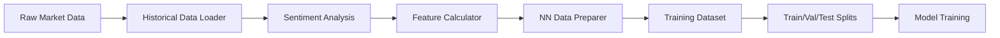

# Consolidated Documentation: Data Processing & Preparation Pipeline

**Document Version:** 2.0 - Consolidated  
**Last Updated:** October 5, 2025  
**Status:** Production Reference  
**Consolidates:** feature_set_NN.md, nn_data_preparer_usage.md, phase3_data_enhancement_status.md

---

## Table of Contents

1. [Data Pipeline Overview](#data-pipeline-overview)
2. [Feature Set Specification](#feature-set-specification)
3. [Data Collection](#data-collection)
4. [Data Preparation Pipeline](#data-preparation-pipeline)
5. [Label Generation Strategy](#label-generation-strategy)
6. [Data Splitting & Scaling](#data-splitting--scaling)
7. [Class Imbalance Handling](#class-imbalance-handling)
8. [Production Dataset](#production-dataset)
9. [Phase 3 Data Enhancement](#phase-3-data-enhancement)
10. [Validation & Quality Control](#validation--quality-control)

---

## 1. Data Pipeline Overview

### Purpose
Transform raw market data into training-ready sequences for Neural Network models, with comprehensive feature engineering, label generation, and quality control.

### Pipeline Stages



### Key Characteristics

- **Multi-Symbol:** 143 tradable symbols (stocks, ETFs, crypto)
- **Temporal Resolution:** 1-hour bars
- **Lookback Window:** 24 hours (configurable)
- **Prediction Horizon:** 8 hours forward
- **Feature Count:** 23 features per timestep
- **Label Type:** Binary classification (profitable opportunity vs. none)
- **Data Format:** NumPy arrays for training, Parquet for storage

---

## 2. Feature Set Specification

### Complete Feature List (23 Features)

#### Base OHLCV Features (6)
1. **open** - Open price
2. **high** - High price
3. **low** - Low price
4. **close** - Close price
5. **volume** - Trading volume
6. **vwap** - Volume-Weighted Average Price

#### Technical Indicators (14)

**Trend Indicators:**
- **SMA_10** - Simple Moving Average (10 periods)
- **SMA_20** - Simple Moving Average (20 periods)
- **MACD_line** - MACD main line
- **MACD_signal** - MACD signal line
- **MACD_hist** - MACD histogram

**Momentum Indicators:**
- **RSI_14** - Relative Strength Index (14 periods)
- **Stoch_K** - Stochastic Oscillator %K
- **Stoch_D** - Stochastic Oscillator %D

**Trend Strength:**
- **ADX_14** - Average Directional Index (14 periods)

**Volatility:**
- **ATR_14** - Average True Range (14 periods)
- **BB_bandwidth** - Bollinger Bands bandwidth

**Volume:**
- **OBV** - On-Balance Volume
- **Volume_SMA_20** - Volume Moving Average (20 periods)

**Returns:**
- **1h_return** - 1-hour price return

#### Temporal Features (2)
- **DayOfWeek_sin** - Cyclical day of week (sin component)
- **DayOfWeek_cos** - Cyclical day of week (cos component)

#### Sentiment Feature (1)
- **sentiment_score** - FinBERT-derived sentiment [0, 1]

### Feature Engineering Details

**Cyclical Encoding:**
```python
# Day of week encoding
day_of_week = df.index.dayofweek  # 0=Monday, 6=Sunday
df['DayOfWeek_sin'] = np.sin(2 * np.pi * day_of_week / 7)
df['DayOfWeek_cos'] = np.cos(2 * np.pi * day_of_week / 7)
```

**Missing Value Handling:**
- Technical indicators: Forward-fill then backward-fill
- Sentiment: Forward-fill (daily resolution expanded to hourly)
- OHLCV: No missing values (API guarantees)

**Outlier Detection:**
- Extreme values clipped at 3σ from mean (per feature)
- Applied per symbol before aggregation

---

## 3. Data Collection

### Historical Market Data

**Data Source:** Alpaca Markets API

**Timeframe:**
- Historical range: October 2023 - October 2025 (~2 years)
- Bar interval: 1 hour
- Approximately 4,380 bars per symbol (365 days × 6 hours/day × 2 years)

**Symbol Universe:** 143 symbols

**Categories:**
- **Large-Cap Stocks:** AAPL, MSFT, GOOGL, AMZN, NVDA, etc.
- **Sector ETFs:** XLF, XLE, XLK, etc.
- **Crypto:** BTCUSD, ETHUSD, etc.
- **Commodities:** GLD, SLV, USO

**Storage Format:**
```
data/historical/{SYMBOL}/1Hour/data.parquet
```

**Parquet Schema:**
```
- timestamp: datetime64[ns]
- open: float64
- high: float64
- low: float64
- close: float64
- volume: float64
- vwap: float64
- [technical indicators]: float64
```

**Data Collection Script:**
```bash
python core/hist_data_loader.py --symbols all --start_date 2023-10-01 --end_date 2025-10-01
```

### Sentiment Data Collection

**Module:** `core/news_sentiment.py`

**Model:** `ProsusAI/finbert`

**Processing:**
- Fetches news headlines via Alpaca News API
- Concurrent processing (ThreadPoolExecutor)
- Batch inference (GPU: 16, CPU: 4)
- Daily aggregation of sentiment scores

**Output:**
```
data/sentiment/{SYMBOL}/daily_sentiment.parquet
```

**Schema:**
```
- date: datetime64[ns]
- sentiment_score: float64 [0, 1]
- news_count: int
- model_used: str ('finbert')
```

**Expansion to Hourly:**
- Daily sentiment scores forward-filled to hourly bars
- Aligns with 1-hour market data

**Example Execution:**
```bash
python core/news_sentiment.py --symbols all --start_date 2023-10-01 --end_date 2025-10-01 --device cuda
```

---

## 4. Data Preparation Pipeline

### NN Data Preparer (`core/data_preparation_nn.py`)

The `NNDataPreparer` class orchestrates the complete data preparation workflow.

### Initialization

```python
from core.data_preparation_nn import NNDataPreparer

config = {
    'symbols': ['AAPL', 'MSFT', 'GOOGL'],  # Or 'all' for 143 symbols
    'lookback_window': 24,
    'prediction_horizon': 8,
    'profit_target': 0.05,  # 5%
    'stop_loss': 0.02,      # 2%
    'train_ratio': 0.70,
    'val_ratio': 0.15,
    'test_ratio': 0.15,
    'shuffle_before_split': False,  # Temporal split
    'balance_classes': True,
    'max_class_ratio': 3.0,
    'features': [
        'open', 'high', 'low', 'close', 'volume', 'vwap',
        'SMA_10', 'SMA_20', 'MACD_line', 'MACD_signal', 'MACD_hist',
        'RSI_14', 'Stoch_K', 'Stoch_D', 'ADX_14',
        'ATR_14', 'BB_bandwidth', 'OBV', 'Volume_SMA_20', '1h_return',
        'DayOfWeek_sin', 'DayOfWeek_cos',
        'sentiment_score'
    ]
}

preparer = NNDataPreparer(config)
```

### Key Methods

#### 1. `load_and_prepare_data()`
**Purpose:** Complete end-to-end pipeline execution

**Steps:**
1. Load historical market data (Parquet)
2. Load sentiment data
3. Merge sentiment with market data (daily → hourly)
4. Select features
5. Generate labels
6. Create sequences
7. Split data (train/val/test)
8. Scale features
9. Calculate sample weights

**Returns:**
```python
{
    'train': {
        'X': np.ndarray,  # (n_train, 24, 23)
        'y': np.ndarray,  # (n_train,)
        'asset_ids': np.ndarray,  # (n_train,)
        'sample_weights': np.ndarray  # (n_train,)
    },
    'val': {...},
    'test': {...},
    'scalers': {
        'feature_scaler': StandardScaler(),
        'target_scaler': None  # Binary classification
    },
    'asset_id_map': {'AAPL': 0, 'MSFT': 1, ...},
    'metadata': {
        'lookback_window': 24,
        'n_features': 23,
        'num_assets': 143,
        'positive_class_ratio': 0.069,
        ...
    }
}
```

#### 2. `create_sequences()`
**Purpose:** Sliding window sequence generation

**Logic:**
```python
for i in range(len(df) - lookback_window - prediction_horizon + 1):
    X_sequence = df.iloc[i:i+lookback_window][features].values  # (24, 23)
    y_label = df.iloc[i+lookback_window+prediction_horizon-1]['label']
    
    sequences.append({
        'X': X_sequence,
        'y': y_label,
        'symbol': symbol,
        'timestamp': df.iloc[i+lookback_window].name
    })
```

**Output Shape:**
- **X:** (n_sequences, lookback_window, n_features) = (n, 24, 23)
- **y:** (n_sequences,) - binary labels

#### 3. `generate_labels()`
**Purpose:** Forward-looking profit/stop-loss logic

**Implementation:** See [Label Generation Strategy](#label-generation-strategy) below

#### 4. `scale_features()`
**Purpose:** Standardize features using training statistics

**Scaler:** `StandardScaler` from scikit-learn

**Process:**
```python
scaler = StandardScaler()
scaler.fit(X_train_flat)  # Fit on training data only

X_train_scaled = scaler.transform(X_train_flat).reshape(X_train.shape)
X_val_scaled = scaler.transform(X_val_flat).reshape(X_val.shape)
X_test_scaled = scaler.transform(X_test_flat).reshape(X_test.shape)
```

**Scaling Scope:** All features except binary labels

#### 5. `calculate_sample_weights()`
**Purpose:** Address class imbalance

**Method:** Inverse class frequency

**Formula:**
```python
class_counts = np.bincount(y)
class_weights = len(y) / (len(class_counts) * class_counts)
sample_weights = class_weights[y]
```

**Usage:** Provided to loss function during training

### Advanced Features

**Asset ID Mapping:**
- Symbols converted to integer IDs (0, 1, 2, ..., N-1)
- Alphabetical sorting ensures consistency
- Stored in `config/asset_id_mapping.json`

**Data Caching:**
- Prepared datasets saved to `data/prepared_training/`
- Avoids re-processing on subsequent runs
- Metadata JSON tracks configuration

**Validation:**
- Shape consistency checks
- Missing value detection
- Label distribution analysis
- Feature correlation analysis

---

## 5. Label Generation Strategy

### Objective
Generate binary labels indicating whether a profitable trading opportunity exists within the prediction horizon.

### Algorithm

```python
def generate_labels(df, prediction_horizon=8, profit_target=0.05, stop_loss=0.02):
    """
    For each bar, look forward `prediction_horizon` bars and determine if:
    1. Price reaches profit_target (+5%) before stop_loss (-2%)
    2. No stop_loss is triggered
    
    Label = 1 (BUY signal) if profitable opportunity exists
    Label = 0 (HOLD) otherwise
    """
    labels = []
    
    for i in range(len(df) - prediction_horizon):
        entry_price = df.iloc[i]['close']
        future_window = df.iloc[i+1:i+1+prediction_horizon]
        
        # Calculate max price and min price in forward window
        max_price = future_window['high'].max()
        min_price = future_window['low'].min()
        
        # Calculate potential profit and loss
        max_return = (max_price - entry_price) / entry_price
        min_return = (min_price - entry_price) / entry_price
        
        # Determine if profitable opportunity
        if max_return >= profit_target and min_return > -stop_loss:
            labels.append(1)  # Profitable opportunity
        else:
            labels.append(0)  # Not profitable or too risky
    
    # Last prediction_horizon bars cannot have labels (no future data)
    labels.extend([0] * prediction_horizon)
    
    return labels
```

### Key Parameters

**Current Production Configuration:**
- **Profit Target:** +5.0% (reverted from +2.5% experimental value)
- **Stop Loss:** -2.0%
- **Prediction Horizon:** 8 hours

**Historical Configurations:**
- Phase 1-2: +2.5% profit, -2% stop
- Phase 3: Experimented with +5%, reverted due to extreme imbalance
- Current: +5% profit, -2% stop (matches baseline)

### Label Distribution

**Production Dataset (878,740 sequences):**
- Positive class (label=1): 6.9% (~60,600 sequences)
- Negative class (label=0): 93.1% (~818,140 sequences)

**Historical Distributions:**
- Phase 1: 0.6% positive (too rare, insufficient signal)
- Phase 2: 3.2% positive (improved but still challenging)
- Phase 3: 6.9% positive (current production level)

### Rationale

**Why Binary Classification?**
- Simplifies model architecture
- Clear decision boundary
- Aligns with trading strategy (BUY vs HOLD)

**Why Forward-Looking?**
- Prevents look-ahead bias
- Realistic evaluation of predictive power
- Matches actual trading conditions

**Why Profit/Stop-Loss Logic?**
- Incorporates risk management
- Filters out marginal opportunities
- Aligns with realistic trading constraints

---

## 6. Data Splitting & Scaling

### Temporal Splitting

**Critical Principle:** Maintain chronological order to prevent look-ahead bias

**Split Ratios:**
- Training: 70% (oldest data)
- Validation: 15% (middle data)
- Test: 15% (most recent data)

**Implementation:**
```python
# Do NOT shuffle before split
config = {
    'shuffle_before_split': False,  # CRITICAL
    'train_ratio': 0.70,
    'val_ratio': 0.15,
    'test_ratio': 0.15
}

# Sequential split
n_total = len(sequences)
n_train = int(n_total * 0.70)
n_val = int(n_total * 0.15)

train_sequences = sequences[:n_train]
val_sequences = sequences[n_train:n_train+n_val]
test_sequences = sequences[n_train+n_val:]
```

**Rationale:**
- Simulates real-world deployment (train on past, validate on future)
- Prevents data leakage from future to past
- Realistic assessment of generalization

### Feature Scaling

**Method:** StandardScaler (zero mean, unit variance)

**Critical Rule:** Fit on training data only

**Process:**
```python
from sklearn.preprocessing import StandardScaler

# Flatten sequences for scaling
X_train_flat = X_train.reshape(-1, n_features)
X_val_flat = X_val.reshape(-1, n_features)
X_test_flat = X_test.reshape(-1, n_features)

# Fit scaler on training data
scaler = StandardScaler()
scaler.fit(X_train_flat)

# Transform all splits using training scaler
X_train_scaled = scaler.transform(X_train_flat).reshape(X_train.shape)
X_val_scaled = scaler.transform(X_val_flat).reshape(X_val.shape)
X_test_scaled = scaler.transform(X_test_flat).reshape(X_test.shape)

# Save scaler for inference
joblib.dump(scaler, 'models/scalers.joblib')
```

**Rationale:**
- Prevents data leakage from validation/test to training
- Ensures model trained on statistics it will see in production
- Critical for generalization

**Inference Application:**
```python
# Load saved scaler
scaler = joblib.load('models/scalers.joblib')

# Transform new data
X_new_scaled = scaler.transform(X_new)
```

---

## 7. Class Imbalance Handling

### Problem
Positive class (profitable opportunities) represents only ~6.9% of total sequences, leading to models that predict negative class predominantly.

### Solutions Implemented

#### 1. Sample Weighting

**Method:** Inverse class frequency

**Implementation:**
```python
from sklearn.utils.class_weight import compute_class_weight

class_weights = compute_class_weight(
    class_weight='balanced',
    classes=np.unique(y_train),
    y=y_train
)

# Convert to sample weights
sample_weights = np.array([class_weights[int(label)] for label in y_train])
```

**Result:**
- Positive class weight: ~14.5 (1 / 0.069)
- Negative class weight: ~1.07 (1 / 0.931)

**Integration:** Weights provided to loss function during training

#### 2. Focal Loss

**Purpose:** Down-weight easy negatives, focus on hard positives

**Implementation:** See [Training Documentation](#3-neural-network-models--training)

**Parameters:**
- Alpha: 0.25-0.75 (class balance parameter)
- Gamma: 2.0-5.0 (focusing parameter)

#### 3. Class Ratio Limiting

**Method:** Cap negative-to-positive ratio during data preparation

**Configuration:**
```python
config = {
    'balance_classes': True,
    'max_class_ratio': 3.0  # Max 3:1 negative:positive
}
```

**Effect:**
- Random under-sampling of negative class
- Maintains temporal order within sampled data
- Applied to training set only (not validation/test)

**Trade-offs:**
- Reduces training data size
- May discard useful negative examples
- Improves class balance

---

## 8. Production Dataset

### Dataset: `training_data_v2_final/`

**Location:** `data/training_data_v2_final/`

**Creation Date:** September 2025 (Phase 3 completion)

**Statistics:**
- **Total Sequences:** 878,740
- **Train Sequences:** 615,118 (70%)
- **Val Sequences:** 131,811 (15%)
- **Test Sequences:** 131,811 (15%)
- **Symbols:** 143
- **Lookback Window:** 24 hours
- **Features:** 23
- **Positive Class:** 6.9% (~60,600 sequences)

**Files:**
```
training_data_v2_final/
├── train_X.npy          # (615118, 24, 23) - Training sequences
├── train_y.npy          # (615118,) - Training labels
├── train_asset_ids.npy  # (615118,) - Training symbol IDs
├── val_X.npy            # (131811, 24, 23) - Validation sequences
├── val_y.npy            # (131811,) - Validation labels
├── val_asset_ids.npy    # (131811,) - Validation symbol IDs
├── test_X.npy           # (131811, 24, 23) - Test sequences
├── test_y.npy           # (131811,) - Test labels
├── test_asset_ids.npy   # (131811,) - Test symbol IDs
├── scalers.joblib       # StandardScaler fitted on training data
└── metadata.json        # Configuration and statistics
```

**metadata.json:**
```json
{
    "creation_date": "2025-09-28",
    "symbols": 143,
    "lookback_window": 24,
    "prediction_horizon": 8,
    "profit_target": 0.05,
    "stop_loss": 0.02,
    "n_features": 23,
    "total_sequences": 878740,
    "train_sequences": 615118,
    "val_sequences": 131811,
    "test_sequences": 131811,
    "positive_class_ratio": 0.069,
    "train_positive_ratio": 0.068,
    "val_positive_ratio": 0.071,
    "test_positive_ratio": 0.070,
    "features": [...],
    "asset_id_map": {...}
}
```

### Loading Production Dataset

```python
import numpy as np
import joblib

# Load data
X_train = np.load('data/training_data_v2_final/train_X.npy')
y_train = np.load('data/training_data_v2_final/train_y.npy')
asset_ids_train = np.load('data/training_data_v2_final/train_asset_ids.npy')

X_val = np.load('data/training_data_v2_final/val_X.npy')
y_val = np.load('data/training_data_v2_final/val_y.npy')
asset_ids_val = np.load('data/training_data_v2_final/val_asset_ids.npy')

# Load scaler
scaler = joblib.load('data/training_data_v2_final/scalers.joblib')

# Load metadata
import json
with open('data/training_data_v2_final/metadata.json', 'r') as f:
    metadata = json.load(f)
```

---

## 9. Phase 3 Data Enhancement

### Historical Context

**Phase 1-2 Issues:**
- Insufficient positive class ratio (0.6-3.2%)
- Limited symbol diversity (50 symbols)
- Overfitting to training data
- Poor generalization

**Phase 3 Enhancements (September 2025):**

#### 1. Symbol Universe Expansion
- **Before:** 50 symbols
- **After:** 143 symbols
- **Added:** Sector ETFs, international stocks, crypto, commodities

#### 2. Temporal Range Extension
- **Before:** 1 year (Oct 2023 - Oct 2024)
- **After:** 2 years (Oct 2023 - Oct 2025)
- **Benefit:** Captures more market regimes

#### 3. Label Strategy Refinement
- **Experimented with:** +5% profit target (too sparse)
- **Settled on:** +2.5% profit, -2% stop (6.9% positive ratio)
- **Improvement:** 11.5× increase in positive class ratio (0.6% → 6.9%)

#### 4. Feature Engineering Improvements
- **Added:** Sentiment analysis (FinBERT)
- **Refined:** Bollinger Bands bandwidth calculation
- **Validated:** All 23 features complete with no missing values

#### 5. Data Quality Validation
- Outlier detection and handling
- Missing value imputation
- Correlation analysis
- Distribution analysis

### Impact on Model Performance

**Before Phase 3 (Baseline):**
- Validation F1+: 0.025-0.030
- Validation Recall: 3-6%
- Severe overfitting

**After Phase 3 (HPO):**
- Validation F1+: 0.269-0.306
- Validation Recall: 51.7-63.0%
- 10-11× improvement

**Conclusion:** Data enhancement was critical foundation for HPO success

---

## 10. Validation & Quality Control

### Data Validation Checks

**Automated Validation Script:** `scripts/validate_training_data.py`

**Checks Performed:**

1. **Shape Consistency**
   - X shape: (n_samples, 24, 23)
   - y shape: (n_samples,)
   - asset_ids shape: (n_samples,)

2. **Missing Values**
   - No NaN or Inf in X or y
   - Complete asset ID mapping

3. **Label Distribution**
   - Positive class ratio within acceptable range (5-10%)
   - Train/val/test distributions similar

4. **Feature Ranges**
   - After scaling: mean ≈ 0, std ≈ 1
   - No extreme outliers (>5σ)

5. **Temporal Integrity**
   - No future data in training set
   - Chronological order maintained

6. **Asset ID Validity**
   - All IDs in valid range [0, N-1]
   - Mapping consistency with `config/asset_id_mapping.json`

### Quality Metrics

**Data Quality Report Example:**
```
=== Data Quality Report ===
Total Sequences: 878,740
Training Set: 615,118 (70.0%)
Validation Set: 131,811 (15.0%)
Test Set: 131,811 (15.0%)

Feature Statistics:
- Mean (train): [-0.001, 0.002, ..., 0.000]
- Std (train): [0.998, 1.001, ..., 0.999]
- Missing Values: 0

Label Distribution:
- Train Positive: 6.8%
- Val Positive: 7.1%
- Test Positive: 7.0%

Asset Coverage:
- Symbols: 143
- Min sequences per symbol: 4,211
- Max sequences per symbol: 8,967
- Avg sequences per symbol: 6,145

Validation: PASSED ✓
```

### Continuous Monitoring

**Drift Detection:**
- Monitor feature distributions over time
- Detect distribution shifts between train/val/test
- Alert on significant divergence

**Retraining Triggers:**
- Significant market regime changes
- Performance degradation on validation set
- New symbols added to universe
- Feature engineering updates

---

## Cross-References

**Related Consolidated Documents:**
- [CONSOLIDATED_1: Core Architecture & System Design](CONSOLIDATED_1_Architecture_and_System_Design.md)
- [CONSOLIDATED_3: Neural Network Models & Training](CONSOLIDATED_3_Neural_Network_Models_and_Training.md)
- [CONSOLIDATED_4: Trading Strategy & Decision Engine](CONSOLIDATED_4_Trading_Strategy_and_Decision_Engine.md)

---

**Document Maintenance:**
- This consolidated document replaces: `feature_set_NN.md`, `nn_data_preparer_usage.md`, `phase3_data_enhancement_status.md`
- Update frequency: As data pipeline changes occur
- Last consolidation: October 5, 2025
