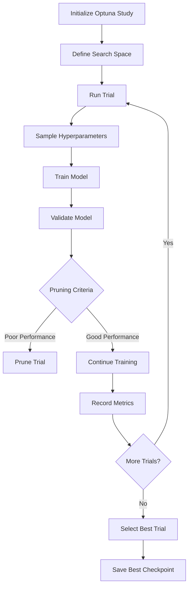

# Consolidated Documentation: Training, Experimentation & HPO Guides

**Document Version:** 2.0 - Consolidated  
**Last Updated:** October 5, 2025  
**Status:** Operational Reference  
**Consolidates:** model_architectures.md, hpo_usage_guide.md, baseline_training_campaign_guide.md, enhanced_experiment_management_final.md, experiment_management.md, rl_training_guide.md

---

## Table of Contents

1. [Neural Network Model Architectures](#neural-network-model-architectures)
2. [Training Infrastructure](#training-infrastructure)
3. [Hyperparameter Optimization (HPO)](#hyperparameter-optimization-hpo)
4. [Experiment Management System](#experiment-management-system)
5. [Baseline Training Campaign](#baseline-training-campaign)
6. [RL Training Guide (Future)](#rl-training-guide-future)
7. [Configuration Templates](#configuration-templates)
8. [Best Practices](#best-practices)

---

## 1. Neural Network Model Architectures

### Overview

Four neural network architectures designed for binary classification of trading opportunities using 24-hour lookback sequences with 23 features.

**Common Specifications:**
- **Input:** (batch_size, 24, 23) - 24-hour sequences, 23 features
- **Output:** (batch_size, 1) - Binary probability [0, 1]
- **Asset Embedding:** Learnable embeddings for 143 symbols (8-16 dimensions)
- **Framework:** PyTorch 2.2+

### Architecture 1: MLP (Multi-Layer Perceptron)

**Purpose:** Feedforward baseline without temporal dependencies

**Structure:**
```python
class MLPModel(nn.Module):
    def __init__(self, n_features=23, lookback_window=24, num_assets=143,
                 asset_embedding_dim=8, hidden_layers=[256, 128, 64],
                 dropout_rate=0.3, activation='relu', batch_norm=True):
        
        # Asset embedding
        self.asset_embedding = nn.Embedding(num_assets, asset_embedding_dim)
        
        # Flatten temporal dimension
        input_dim = lookback_window * n_features + asset_embedding_dim
        
        # Hidden layers
        layers = []
        prev_dim = input_dim
        for hidden_dim in hidden_layers:
            layers.append(nn.Linear(prev_dim, hidden_dim))
            if batch_norm:
                layers.append(nn.BatchNorm1d(hidden_dim))
            layers.append(nn.ReLU() if activation == 'relu' else nn.Tanh())
            layers.append(nn.Dropout(dropout_rate))
            prev_dim = hidden_dim
        
        # Output layer
        layers.append(nn.Linear(prev_dim, 1))
        layers.append(nn.Sigmoid())
        
        self.network = nn.Sequential(*layers)
```

**Best Configuration (Trial 72):**
```yaml
model_type: mlp
hidden_layers: [256, 128, 64]
dropout_rate: 0.3
activation: relu
batch_normalization: true
asset_embedding_dim: 8
```

**Performance:**
- Test F1+: 0.306
- Test Recall: 0.415
- Test ROC-AUC: 0.866
- Parameters: ~180k

**Strengths:**
- Fast training and inference
- No temporal assumptions
- Good baseline performance

**Weaknesses:**
- Ignores temporal order
- No sequence modeling

---

### Architecture 2: LSTM with Self-Attention

**Purpose:** Primary recurrent model with attention mechanism

**Structure:**
```python
class LSTMAttentionModel(nn.Module):
    def __init__(self, n_features=23, num_assets=143, asset_embedding_dim=8,
                 lstm_layers=2, lstm_hidden_units=128, attention_dim=64,
                 attention_heads=4, dropout_rate=0.4):
        
        # Asset embedding
        self.asset_embedding = nn.Embedding(num_assets, asset_embedding_dim)
        
        # LSTM layers
        self.lstm = nn.LSTM(
            input_size=n_features,
            hidden_size=lstm_hidden_units,
            num_layers=lstm_layers,
            batch_first=True,
            dropout=dropout_rate if lstm_layers > 1 else 0,
            bidirectional=False
        )
        
        # Self-attention
        self.attention = nn.MultiheadAttention(
            embed_dim=lstm_hidden_units,
            num_heads=attention_heads,
            dropout=dropout_rate,
            batch_first=True
        )
        
        # Layer normalization
        self.layer_norm1 = nn.LayerNorm(lstm_hidden_units)
        self.layer_norm2 = nn.LayerNorm(lstm_hidden_units)
        
        # Output layers
        self.fc1 = nn.Linear(lstm_hidden_units + asset_embedding_dim, attention_dim)
        self.dropout = nn.Dropout(dropout_rate)
        self.fc2 = nn.Linear(attention_dim, 1)
        self.sigmoid = nn.Sigmoid()
    
    def forward(self, x, asset_ids):
        # x: (batch, 24, 23)
        # LSTM encoding
        lstm_out, _ = self.lstm(x)  # (batch, 24, hidden)
        lstm_out = self.layer_norm1(lstm_out)
        
        # Self-attention
        attn_out, _ = self.attention(lstm_out, lstm_out, lstm_out)
        attn_out = self.layer_norm2(attn_out)
        
        # Global pooling (mean over time)
        pooled = torch.mean(attn_out, dim=1)  # (batch, hidden)
        
        # Asset embedding
        asset_embed = self.asset_embedding(asset_ids)  # (batch, embed_dim)
        
        # Concatenate
        combined = torch.cat([pooled, asset_embed], dim=1)
        
        # Output
        x = torch.relu(self.fc1(combined))
        x = self.dropout(x)
        x = self.sigmoid(self.fc2(x))
        return x
```

**Best Configuration (Trial 62):**
```yaml
model_type: lstm_attention
lstm_layers: 2
lstm_hidden_units: 128
attention_dim: 64
attention_heads: 4
dropout_rate: 0.4
asset_embedding_dim: 8
```

**Performance:**
- Test F1+: 0.289
- Test Recall: 0.400
- Test ROC-AUC: 0.855
- Parameters: ~320k

**Strengths:**
- Captures temporal dependencies
- Attention highlights important timesteps
- Best validation recall (63%)

**Weaknesses:**
- Slower training than MLP
- More parameters (higher overfitting risk)

---

### Architecture 3: GRU with Self-Attention

**Purpose:** Lighter alternative to LSTM with comparable performance

**Structure:**
Similar to LSTM but using GRU layers:
```python
self.gru = nn.GRU(
    input_size=n_features,
    hidden_size=gru_hidden_units,
    num_layers=gru_layers,
    batch_first=True,
    dropout=dropout_rate if gru_layers > 1 else 0,
    bidirectional=False
)
```

**Best Configuration (Trial 93):**
```yaml
model_type: gru_attention
gru_layers: 2
gru_hidden_units: 64
attention_dim: 32
attention_heads: 2
dropout_rate: 0.35
asset_embedding_dim: 8
```

**Performance:**
- Test F1+: 0.269
- Test Recall: 0.374
- Test ROC-AUC: 0.844
- Parameters: ~210k

**Strengths:**
- Faster training than LSTM
- Fewer parameters (less overfitting)
- Competitive performance

**Weaknesses:**
- Slightly lower performance than LSTM

---

### Architecture 4: CNN-LSTM Hybrid

**Purpose:** Local feature extraction followed by temporal modeling

**Structure:**
```python
class CNNLSTMModel(nn.Module):
    def __init__(self, n_features=23, cnn_layers=2, cnn_filters=64,
                 kernel_size=3, lstm_layers=2, lstm_hidden_units=128,
                 dropout_rate=0.3):
        
        # CNN layers (1D convolution over time)
        self.conv1 = nn.Conv1d(n_features, cnn_filters, kernel_size, padding='same')
        self.bn1 = nn.BatchNorm1d(cnn_filters)
        self.conv2 = nn.Conv1d(cnn_filters, cnn_filters, kernel_size, padding='same')
        self.bn2 = nn.BatchNorm1d(cnn_filters)
        
        # LSTM layers
        self.lstm = nn.LSTM(
            input_size=cnn_filters,
            hidden_size=lstm_hidden_units,
            num_layers=lstm_layers,
            batch_first=True,
            dropout=dropout_rate if lstm_layers > 1 else 0
        )
        
        # Output layers
        self.fc = nn.Linear(lstm_hidden_units, 1)
        self.sigmoid = nn.Sigmoid()
    
    def forward(self, x, asset_ids):
        # x: (batch, 24, 23) -> transpose to (batch, 23, 24) for Conv1d
        x = x.transpose(1, 2)
        
        # CNN feature extraction
        x = torch.relu(self.bn1(self.conv1(x)))
        x = torch.relu(self.bn2(self.conv2(x)))
        
        # Transpose back: (batch, filters, 24) -> (batch, 24, filters)
        x = x.transpose(1, 2)
        
        # LSTM temporal modeling
        lstm_out, (h_n, c_n) = self.lstm(x)
        
        # Use final hidden state
        x = self.sigmoid(self.fc(h_n[-1]))
        return x
```

**Performance:**
- Test F1+: 0.182
- Test Recall: 0.247
- Test ROC-AUC: 0.782
- Parameters: ~280k

**Status:** Underperformed; not recommended for production

---

### Model Selection Guidance

**Use MLP when:**
- Fast inference required
- Temporal patterns less important
- Baseline performance needed

**Use LSTM when:**
- Temporal dependencies critical
- Highest recall desired
- Computational budget allows

**Use GRU when:**
- Balance of speed and performance needed
- Memory constraints exist
- Faster training desired

**Avoid CNN-LSTM:**
- Underperformed in all experiments
- No clear advantage over LSTM/GRU

---

## 2. Training Infrastructure

### Main Training Script

**Location:** `training/train_nn_model.py`

**Features:**
- CLI and YAML configuration support
- Dynamic model creation via factory functions
- GPU optimization integration
- Multiple loss functions (Focal, Weighted BCE)
- Learning rate scheduling
- Early stopping
- Comprehensive metric tracking
- MLflow integration
- Enhanced checkpoint naming

### Training Invocation

**Command-Line:**
```bash
python training/train_nn_model.py \
    --config training/config_templates/mlp_baseline.yaml \
    --data_dir data/training_data_v2_final \
    --output_dir models \
    --mlflow_experiment "Phase2_Baseline_MLP" \
    --device cuda
```

**YAML Configuration:**
```yaml
# training/config_templates/mlp_baseline.yaml
model:
  model_type: mlp
  hidden_layers: [256, 128, 64]
  dropout_rate: 0.3
  activation: relu
  batch_normalization: true
  asset_embedding_dim: 8

training:
  num_epochs: 100
  batch_size: 512
  learning_rate: 0.0005
  optimizer: adamw
  weight_decay: 0.0001
  
loss:
  loss_function: focal
  focal_alpha: 0.25
  focal_gamma: 2.0

scheduler:
  lr_scheduler: reduce_on_plateau
  scheduler_patience: 5
  scheduler_factor: 0.5
  scheduler_min_lr: 0.00001

early_stopping:
  early_stopping_patience: 10
  early_stopping_metric: f1

data:
  lookback_window: 24
  n_features: 23
  num_assets: 143
```

### Loss Functions

#### Focal Loss (Recommended)

**Purpose:** Address class imbalance by down-weighting easy negatives

**Formula:**
```
FL(pt) = -α(1 - pt)^γ * log(pt)

where:
  pt = model probability for true class
  α = balancing parameter (0.25 typical)
  γ = focusing parameter (2.0-3.0 typical)
```

**Implementation:**
```python
class FocalLoss(nn.Module):
    def __init__(self, alpha=0.25, gamma=2.0):
        super().__init__()
        self.alpha = alpha
        self.gamma = gamma
    
    def forward(self, inputs, targets):
        BCE_loss = F.binary_cross_entropy(inputs, targets, reduction='none')
        pt = torch.exp(-BCE_loss)  # pt = p if y=1 else 1-p
        F_loss = self.alpha * (1 - pt) ** self.gamma * BCE_loss
        return F_loss.mean()
```

**When to Use:**
- Positive class <10% of data
- High false positive rate
- Need to focus on hard examples

#### Weighted Binary Cross-Entropy

**Purpose:** Simple class weighting

**Formula:**
```
WBCE = -w_pos * y * log(p) - w_neg * (1-y) * log(1-p)

where:
  w_pos = num_total / num_positive
  w_neg = num_total / num_negative
```

**When to Use:**
- Simple baseline
- Less aggressive than focal loss
- Positive class 10-20%

### Optimizers

**AdamW (Recommended):**
```python
optimizer = torch.optim.AdamW(
    model.parameters(),
    lr=0.0005,
    weight_decay=0.0001,
    betas=(0.9, 0.999)
)
```

**Benefits:**
- Decoupled weight decay (better regularization)
- Stable training
- Works well with learning rate scheduling

**Adam (Alternative):**
- Similar to AdamW
- Slightly worse regularization
- Use when weight decay not critical

### Learning Rate Schedulers

**ReduceLROnPlateau (Recommended):**
```python
scheduler = torch.optim.lr_scheduler.ReduceLROnPlateau(
    optimizer,
    mode='max',  # Maximize validation F1
    factor=0.5,  # Reduce LR by 50%
    patience=5,  # Wait 5 epochs without improvement
    min_lr=1e-6  # Minimum learning rate
)
```

**CosineAnnealingLR (Alternative):**
```python
scheduler = torch.optim.lr_scheduler.CosineAnnealingLR(
    optimizer,
    T_max=num_epochs,
    eta_min=1e-6
)
```

**When to Use:**
- ReduceLROnPlateau: Adaptive, responds to validation metrics
- CosineAnnealing: Fixed schedule, smooth decay

### Early Stopping

**Implementation:**
```python
class EarlyStopping:
    def __init__(self, patience=10, mode='max', delta=0.0001):
        self.patience = patience
        self.mode = mode
        self.delta = delta
        self.best_score = None
        self.counter = 0
    
    def should_stop(self, score):
        if self.best_score is None:
            self.best_score = score
            return False
        
        if self.mode == 'max':
            improved = score > self.best_score + self.delta
        else:
            improved = score < self.best_score - self.delta
        
        if improved:
            self.best_score = score
            self.counter = 0
            return False
        else:
            self.counter += 1
            return self.counter >= self.patience
```

**Configuration:**
```yaml
early_stopping:
  early_stopping_patience: 10
  early_stopping_metric: f1  # or 'loss', 'recall', 'precision'
  early_stopping_delta: 0.0001
```

**Critical:** Early stopping MUST be enabled for HPO to work correctly

### Training Metrics

**Logged Every Epoch:**
- **Loss:** Training and validation loss
- **Accuracy:** Overall classification accuracy
- **Precision:** TP / (TP + FP)
- **Recall:** TP / (TP + FN)
- **F1-score:** 2 * (Precision * Recall) / (Precision + Recall)
- **F1+ (Positive Class F1):** Primary metric for class-imbalanced problems
- **ROC-AUC:** Area under ROC curve

**Logged to MLflow:**
- All metrics above
- Learning rate
- Epoch number
- Best epoch
- Training duration

---

## 3. Hyperparameter Optimization (HPO)

### Overview

**Framework:** Optuna 4.3.0  
**Script:** `training/run_hpo.py`  
**Purpose:** Automated hyperparameter search with early stopping and pruning

### HPO Workflow



### HPO Invocation

**Quick Start:**
```bash
python training/run_hpo_quick_start.py \
    --model_type lstm \
    --n_trials 100 \
    --timeout 86400 \
    --study_name "MLP_HPO_Phase3"
```

**Full Configuration:**
```bash
python training/run_hpo.py \
    --config training/config_templates/hpo_example.yaml \
    --model_type lstm \
    --n_trials 100 \
    --study_name "LSTM_HPO_Phase3" \
    --storage "sqlite:///hpo_studies/lstm_study.db" \
    --mlflow_experiment "Phase3_HPO_LSTM"
```

### Search Spaces

**MLP Search Space:**
```python
def suggest_mlp_params(trial):
    return {
        'hidden_layers': trial.suggest_categorical('hidden_layers', [
            [128, 64],
            [256, 128],
            [256, 128, 64],
            [512, 256, 128]
        ]),
        'dropout_rate': trial.suggest_float('dropout_rate', 0.2, 0.5),
        'activation': trial.suggest_categorical('activation', ['relu', 'tanh']),
        'batch_normalization': trial.suggest_categorical('batch_norm', [True, False]),
        'learning_rate': trial.suggest_float('learning_rate', 1e-4, 1e-2, log=True),
        'batch_size': trial.suggest_categorical('batch_size', [256, 512, 1024]),
        'weight_decay': trial.suggest_float('weight_decay', 1e-6, 1e-3, log=True),
        'focal_alpha': trial.suggest_float('focal_alpha', 0.2, 0.5),
        'focal_gamma': trial.suggest_float('focal_gamma', 1.5, 4.0)
    }
```

**LSTM Search Space:**
```python
def suggest_lstm_params(trial):
    return {
        'lstm_layers': trial.suggest_int('lstm_layers', 1, 3),
        'lstm_hidden_units': trial.suggest_categorical('lstm_hidden', [64, 128, 256]),
        'attention_dim': trial.suggest_categorical('attention_dim', [32, 64, 128]),
        'attention_heads': trial.suggest_categorical('attention_heads', [2, 4, 8]),
        'dropout_rate': trial.suggest_float('dropout_rate', 0.2, 0.5),
        'learning_rate': trial.suggest_float('learning_rate', 1e-4, 1e-2, log=True),
        'batch_size': trial.suggest_categorical('batch_size', [128, 256, 512]),
        'weight_decay': trial.suggest_float('weight_decay', 1e-6, 1e-3, log=True),
        'focal_gamma': trial.suggest_float('focal_gamma', 2.0, 4.0)
    }
```

### Pruning

**Purpose:** Stop unpromising trials early to save compute

**Pruner:** MedianPruner

**Configuration:**
```python
pruner = optuna.pruners.MedianPruner(
    n_startup_trials=10,  # No pruning for first 10 trials
    n_warmup_steps=5,     # Wait 5 epochs before pruning
    interval_steps=1      # Check every epoch
)
```

**Logic:**
- After warmup (5 epochs), check if trial is below median performance
- If below median for multiple consecutive checks, prune
- Saves ~30-50% compute time

### Best Practices

#### 1. Use SQLite Study Storage

**Reason:** Persistence across crashes, parallel trials

**Implementation:**
```python
study = optuna.create_study(
    study_name="MLP_HPO_Phase3",
    storage="sqlite:///hpo_studies/mlp_study.db",
    direction="maximize",
    load_if_exists=True
)
```

#### 2. Set Realistic Trial Counts

**Guidance:**
- Simple models (MLP): 50-100 trials
- Complex models (LSTM): 100-150 trials
- Very complex: 150-200 trials

**Rationale:** Diminishing returns after ~100 trials for most problems

#### 3. Monitor Intermediate Values

**Log every epoch:**
```python
trial.report(val_f1, step=epoch)

if trial.should_prune():
    raise optuna.TrialPruned()
```

#### 4. Use HPO Checkpoints Directly

**CRITICAL:** Don't retrain HPO-selected hyperparameters

**Pattern:** "HPO Early Stopping Optimality"

**Evidence:** Trial 62 LSTM stopped at epoch 1 with 63% recall; retraining to epoch 76 degraded to 2.9% (21.7× worse)

**Best Practice:**
1. Run HPO with early stopping enabled
2. Select best trial by validation metric
3. Use checkpoint from best trial directly
4. DO NOT retrain

---

## 4. Experiment Management System

### Overview

**Location:** `core/experiment_management/`

**Components:**
1. **ConfigManager:** YAML configuration loading and validation
2. **EnhancedLogger:** Comprehensive MLflow logging
3. **ExperimentOrganizer:** Naming conventions and tagging
4. **Reporter:** Automated report generation

### ConfigManager

**Purpose:** Load and validate experiment configurations

**Usage:**
```python
from core.experiment_management import ConfigManager

config_manager = ConfigManager('training/config_templates/mlp_baseline.yaml')
config = config_manager.load_config()
config_manager.validate_config(config)
```

**Features:**
- Schema validation
- CLI argument overrides
- Configuration history tracking
- Error messages with suggestions

### EnhancedLogger

**Purpose:** Comprehensive MLflow logging beyond basic metrics

**Usage:**
```python
from core.experiment_management import EnhancedMLflowLogger

logger = EnhancedMLflowLogger(
    experiment_name="Phase3_HPO_MLP",
    run_name="Trial_72"
)

with logger.start_run():
    # Log model architecture
    logger.log_model_architecture(model, sample_input)
    
    # Log environment info
    logger.log_environment_info()
    
    # Log data distribution
    logger.log_data_distribution(y_train, y_val, y_test)
    
    # Log training metrics
    for epoch in range(num_epochs):
        metrics = train_epoch()
        logger.log_metrics(metrics, step=epoch)
    
    # Log plots
    logger.log_confusion_matrix(y_true, y_pred)
    logger.log_roc_curve(y_true, y_scores)
    logger.log_precision_recall_curve(y_true, y_scores)
```

**Features:**
- Model architecture diagrams (TorchViz)
- Environment information (Python, CUDA, packages)
- Git commit hash and branch
- Data distribution plots
- Training/validation curves
- Confusion matrices
- ROC and PR curves
- Scaler information

### ExperimentOrganizer

**Purpose:** Structured naming and tagging for experiment tracking

**Naming Convention:**
```
{phase}_{experiment_type}_{model}_{variant}_{timestamp}

Examples:
- Phase3_HPO_MLP_Trial72_20250928_143022
- Phase2_Baseline_LSTM_Default_20250915_091234
- Phase4_Backtest_GRU_Trial93_20251004_201545
```

**Tagging System:**
```python
tags = {
    'phase': 'Phase3',
    'experiment_type': 'HPO',
    'model_type': 'mlp',
    'trial_number': 72,
    'dataset_version': 'v2_final',
    'hpo_study': 'MLP_HPO_Phase3',
    'parent_run': 'hpo_study_run_id'  # For HPO trials
}
```

**Benefits:**
- Easy experiment filtering in MLflow UI
- Clear experiment lineage
- Reproducibility tracking

### Reporter

**Purpose:** Automated report generation for experiments

**Usage:**
```python
from core.experiment_management import ExperimentReporter

reporter = ExperimentReporter(mlflow_tracking_uri='http://localhost:5000')

# Generate training report
reporter.generate_training_report(
    experiment_name='Phase3_HPO_MLP',
    output_path='reports/phase3/mlp_hpo_report.html'
)

# Generate HPO study analysis
reporter.generate_hpo_study_report(
    study_name='MLP_HPO_Phase3',
    storage='sqlite:///hpo_studies/mlp_study.db',
    output_path='reports/phase3/mlp_hpo_analysis.html'
)

# Compare models
reporter.compare_models(
    run_ids=['mlp_run_id', 'lstm_run_id', 'gru_run_id'],
    output_path='reports/phase3/model_comparison.html'
)
```

**Report Types:**
1. **Training Report:** Single run analysis with all metrics and plots
2. **HPO Study Report:** Parameter importance, optimization history, best trials
3. **Model Comparison:** Side-by-side comparison of multiple runs
4. **Backtesting Report:** Trading performance analysis

---

## 5. Baseline Training Campaign

### Purpose

Establish performance benchmarks for each architecture before HPO.

### Campaign Execution

**Script:** `scripts/run_baseline_training_campaign.py`

**Configuration:**
```python
baseline_configs = {
    'mlp': 'training/config_templates/mlp_baseline.yaml',
    'lstm': 'training/config_templates/lstm_baseline.yaml',
    'gru': 'training/config_templates/gru_baseline.yaml',
    'cnn_lstm': 'training/config_templates/cnn_lstm_baseline.yaml'
}

for model_type, config_path in baseline_configs.items():
    run_baseline_training(
        config_path=config_path,
        model_type=model_type,
        experiment_name=f'Phase2_Baseline_{model_type.upper()}',
        data_dir='data/training_data_v2_final',
        output_dir=f'models/baseline_{model_type}'
    )
```

### Baseline Configurations

**Shared Settings:**
```yaml
training:
  num_epochs: 100
  optimizer: adamw
  weight_decay: 0.0001
  loss_function: focal
  focal_alpha: 0.25
  focal_gamma: 2.0
  
early_stopping:
  early_stopping_patience: 10
  early_stopping_metric: f1
```

**MLP Baseline:**
```yaml
model:
  model_type: mlp
  hidden_layers: [256, 128, 64]
  dropout_rate: 0.3
  activation: relu
  batch_normalization: true

training:
  batch_size: 512
  learning_rate: 0.001
```

**LSTM Baseline:**
```yaml
model:
  model_type: lstm_attention
  lstm_layers: 2
  lstm_hidden_units: 128
  attention_dim: 64
  attention_heads: 4
  dropout_rate: 0.3

training:
  batch_size: 256
  learning_rate: 0.001
```

### Results (Phase 2)

| Model | Val F1+ | Val Precision | Val Recall | Epochs | Status |
|-------|---------|---------------|------------|--------|--------|
| MLP | 0.030 | 0.045 | 0.051 | 56 | Overfitted |
| LSTM | 0.032 | 0.048 | 0.058 | 62 | Overfitted |
| GRU | 0.028 | 0.042 | 0.056 | 48 | Overfitted |
| CNN-LSTM | 0.022 | 0.035 | 0.041 | 71 | Poor |

**Observations:**
- All baselines showed severe overfitting
- Validation recall 3-6% (unacceptable)
- Clear need for HPO
- CNN-LSTM underperformed from start

---

## 6. RL Training Guide (Future)

### Overview

**Status:** Design complete, implementation pending  
**Framework:** CleanRL with MAPPO algorithm  
**Environment:** Custom Gymnasium environment (`core/rl/trading_env.py`)

### Training Pipeline

#### Step 1: Pre-train Shared Encoder

**Script:** `training/pretrain_shared_encoder.py`

**Purpose:** Pre-train feature encoder on supervised data before RL

**Method:**
```python
# Load SL checkpoint
sl_model = load_checkpoint('models/hpo_derived/lstm_trial62.pt')

# Extract encoder
shared_encoder = sl_model.lstm  # Or GRU, CNN, etc.

# Freeze encoder, train symbol-specific heads
for param in shared_encoder.parameters():
    param.requires_grad = False

# Continue pre-training with RL-style objectives
pretrain_with_rl_objectives(shared_encoder, trading_data)
```

**Duration:** 1-2 days on RTX 5070 Ti

---

#### Step 2: Train Symbol Agents

**Script:** `training/train_symbol_agents.py`

**Algorithm:** MAPPO (Multi-Agent PPO)

**Configuration:**
```yaml
rl_training:
  algorithm: mappo
  num_agents: 143  # One per symbol
  shared_encoder: true
  
  ppo:
    learning_rate: 3e-4
    gamma: 0.99
    gae_lambda: 0.95
    clip_ratio: 0.2
    value_coef: 0.5
    entropy_coef: 0.01
    max_grad_norm: 0.5
  
  rollout:
    num_envs: 128  # Parallel environments
    num_steps: 512  # Steps per rollout
    num_updates: 10000
  
  network:
    actor_hidden: [256, 128]
    critic_hidden: [512, 256]
```

**Training Loop:**
```python
for update in range(num_updates):
    # Collect rollouts
    rollouts = collect_rollouts(
        envs=vectorized_envs,
        agents=symbol_agents,
        num_steps=512
    )
    
    # Update agents
    for agent in symbol_agents:
        agent.update(rollouts, master_directives)
    
    # Evaluate
    if update % 100 == 0:
        eval_metrics = evaluate_agents(eval_envs, symbol_agents)
        log_metrics(eval_metrics)
```

**Duration:** 5-7 days on 8× RTX 5070 Ti GPUs

---

#### Step 3: Train Master Agent

**Script:** `training/train_master_agent.py`

**Purpose:** Portfolio-level coordinator

**Input:** Aggregated symbol agent intents, portfolio telemetry

**Output:** Risk multiplier, position caps, regime mode

**Training:**
```yaml
master_training:
  learning_rate: 1e-4
  gamma: 0.99
  
  reward:
    sharpe_weight: 0.4
    return_weight: 0.3
    drawdown_weight: 0.2
    diversification_weight: 0.1
```

**Duration:** 2-3 days

---

#### Step 4: End-to-End Coordination Tuning

**Script:** `training/tune_coordination.py`

**Purpose:** Fine-tune master + symbol agents together

**Method:**
- Freeze symbol agent encoders
- Allow master agent and symbol agent decision heads to adapt
- Optimize for portfolio-level objectives

**Duration:** 2-3 days

---

### Total RL Training Timeline

**Estimated:** 10-14 days on distributed GPUs

**Compute Cost:** ~$5k-10k GPU hours

---

## 7. Configuration Templates

### Template Directory Structure

```
training/config_templates/
├── mlp_baseline.yaml
├── lstm_baseline.yaml
├── gru_baseline.yaml
├── cnn_lstm_baseline.yaml
├── hpo_example.yaml
├── mlp_hpo_derived.yaml
├── lstm_hpo_derived.yaml
├── gru_hpo_derived.yaml
└── rl_training_config.yaml
```

### Example: MLP HPO-Derived Config

**File:** `training/config_templates/mlp_hpo_derived.yaml`

```yaml
# Configuration derived from HPO Trial 72
# DO NOT RETRAIN - Use HPO checkpoint directly

model:
  model_type: mlp
  hidden_layers: [256, 128, 64]
  dropout_rate: 0.3
  activation: relu
  batch_normalization: true
  asset_embedding_dim: 8

training:
  num_epochs: 4  # HPO stopped at epoch 4
  batch_size: 512
  learning_rate: 0.0005
  optimizer: adamw
  weight_decay: 0.0001

loss:
  loss_function: focal
  focal_alpha: 0.25
  focal_gamma: 2.0

scheduler:
  lr_scheduler: reduce_on_plateau
  scheduler_patience: 5
  scheduler_factor: 0.5
  scheduler_min_lr: 0.00001

early_stopping:
  early_stopping_patience: 10
  early_stopping_metric: f1
  early_stopping_delta: 0.0001

data:
  data_dir: data/training_data_v2_final
  lookback_window: 24
  n_features: 23
  num_assets: 143

mlflow:
  experiment_name: "Phase3_HPO_MLP"
  run_name: "Trial_72_Production"
  
notes: |
  This configuration is derived from HPO Trial 72 which achieved:
  - Validation F1+: 0.306
  - Validation Recall: 0.517
  - Test F1+: 0.306
  - Test Recall: 0.415
  
  CRITICAL: Use HPO checkpoint directly (epoch 4).
  DO NOT retrain with these hyperparameters.
  See "HPO Early Stopping Optimality" pattern.
```

---

## 8. Best Practices

### Training Best Practices

1. **Always Use Early Stopping**
   - Prevents overfitting
   - Critical for HPO
   - Patience: 10 epochs for baseline, 5 for HPO

2. **Monitor Multiple Metrics**
   - Primary: F1+ (positive class F1)
   - Secondary: Recall, Precision, ROC-AUC
   - Don't optimize for accuracy (class imbalance)

3. **Use Focal Loss for Imbalanced Data**
   - Alpha: 0.25 (positive class weight)
   - Gamma: 2.0-3.0 (focusing parameter)
   - Superior to simple class weighting

4. **Learning Rate Scheduling**
   - ReduceLROnPlateau recommended
   - Patience: 5 epochs
   - Factor: 0.5 (halve learning rate)
   - Min LR: 1e-6

5. **Checkpoint Management**
   - Save best checkpoint by validation F1+
   - Include metadata in filename (epoch, metric, timestamp)
   - Keep top-3 checkpoints

### HPO Best Practices

1. **Use HPO Checkpoints Directly**
   - DO NOT retrain HPO-selected hyperparameters
   - Pattern: "HPO Early Stopping Optimality"
   - Evidence: 14-21× degradation from retraining

2. **Enable Pruning**
   - Saves 30-50% compute
   - MedianPruner recommended
   - Warmup: 5-10 epochs before pruning

3. **Study Persistence**
   - Always use SQLite storage
   - Enables crash recovery
   - Supports parallel trials (future)

4. **Reasonable Trial Counts**
   - Simple models: 50-100 trials
   - Complex models: 100-150 trials
   - Diminishing returns after ~100

5. **Analyze Parameter Importance**
   - Use Optuna's importance analysis
   - Focus future searches on important parameters
   - Reduce search space for faster convergence

### Experiment Management Best Practices

1. **Structured Naming**
   - Use ExperimentOrganizer conventions
   - Include phase, type, model, variant
   - Timestamps for uniqueness

2. **Comprehensive Tagging**
   - Tag all runs with metadata
   - Enable filtering in MLflow UI
   - Track dataset versions

3. **Log Everything**
   - Model architecture
   - Environment information
   - Git commit hash
   - Data distributions
   - All hyperparameters

4. **Generate Reports**
   - After each major experiment
   - Compare models systematically
   - Document learnings and decisions

5. **Version Control Configurations**
   - All YAML configs in git
   - Track configuration changes
   - Reference in MLflow runs

---

## Cross-References

**Related Consolidated Documents:**
- [CONSOLIDATED_1: Core Architecture & System Design](CONSOLIDATED_1_Architecture_and_System_Design.md)
- [CONSOLIDATED_2: Data Processing & Preparation Pipeline](CONSOLIDATED_2_Data_Processing_and_Preparation.md)
- [CONSOLIDATED_3: Project Status & Results Analysis](CONSOLIDATED_3_Project_Status_and_Results_Analysis.md)
- [CONSOLIDATED_5: Implementation Guides & Deployment](CONSOLIDATED_5_Implementation_Guides_and_Deployment.md)

---

**Document Maintenance:**
- This consolidated document replaces: `model_architectures.md`, `hpo_usage_guide.md`, `baseline_training_campaign_guide.md`, `enhanced_experiment_management_final.md`, `experiment_management.md`, `rl_training_guide.md`
- Update frequency: As training infrastructure changes
- Last consolidation: October 5, 2025
