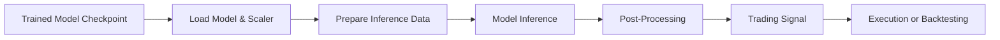
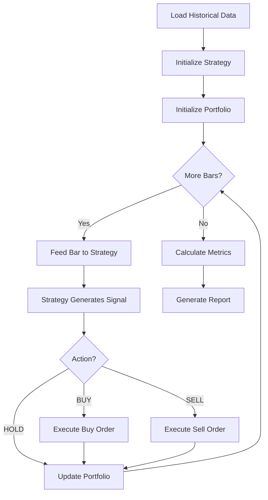
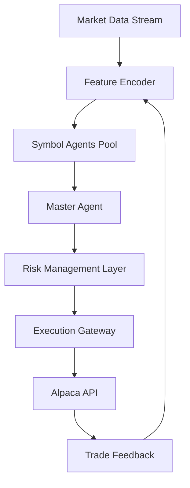

# Consolidated Documentation: Implementation Guides & Deployment

**Document Version:** 2.0 - Consolidated  
**Last Updated:** October 5, 2025  
**Status:** Operational Reference  
**Consolidates:** nn_model_deployment_guide.md, backtesting_logging.md, rl_deployment.md, Output_management.md, model_evaluation_implementation_summary.md

---

## Table of Contents

1. [Neural Network Model Deployment](#neural-network-model-deployment)
2. [Backtesting System](#backtesting-system)
3. [Model Evaluation & Testing](#model-evaluation--testing)
4. [RL System Deployment (Future)](#rl-system-deployment-future)
5. [Output Management & Logging](#output-management--logging)
6. [Production Monitoring](#production-monitoring)
7. [Troubleshooting Guide](#troubleshooting-guide)

---

## 1. Neural Network Model Deployment

### Overview

Deploy trained neural network models for inference in backtesting or live trading environments.

### Deployment Workflow



### Step 1: Model and Scaler Loading

**Load Production Checkpoint:**
```python
import torch
import joblib
from core.models import create_model

# Load model configuration
model_config = {
    'model_type': 'mlp',
    'n_features': 23,
    'lookback_window': 24,
    'num_assets': 143,
    'asset_embedding_dim': 8,
    'hidden_layers': [256, 128, 64],
    'dropout_rate': 0.3,
    'activation': 'relu',
    'batch_normalization': True
}

# Create model architecture
model = create_model(model_config)

# Load trained weights
checkpoint = torch.load('models/hpo_derived/mlp_trial72.pt', map_location='cuda')
model.load_state_dict(checkpoint['model_state_dict'])

# Set to evaluation mode
model.eval()

# Load scaler
scaler = joblib.load('data/training_data_v2_final/scalers.joblib')

# Load asset ID mapping
import json
with open('config/asset_id_mapping.json', 'r') as f:
    asset_mapping = json.load(f)
    symbol_to_id = asset_mapping['symbol_to_id']
```

**Checkpoint Structure:**
```python
checkpoint = {
    'model_state_dict': model.state_dict(),
    'optimizer_state_dict': optimizer.state_dict(),
    'epoch': best_epoch,
    'val_f1': best_f1,
    'hyperparameters': config,
    'timestamp': timestamp
}
```

### Step 2: Prepare Inference Data

**Data Requirements:**
- 24-hour historical window
- 23 features per timestep
- Proper scaling using training scaler
- Asset ID for embedding

**Preparation Function:**
```python
import numpy as np
import pandas as pd

def prepare_inference_data(symbol, current_time, data_loader, scaler, symbol_to_id):
    """
    Prepare 24-hour sequence for model inference.
    
    Args:
        symbol: Trading symbol (e.g., 'AAPL')
        current_time: Current datetime
        data_loader: Historical data loader
        scaler: Fitted StandardScaler
        symbol_to_id: Symbol-to-integer mapping
    
    Returns:
        X_scaled: (1, 24, 23) scaled feature array
        asset_id: Integer asset ID
    """
    # Load 24-hour historical window
    end_time = current_time
    start_time = current_time - pd.Timedelta(hours=24)
    
    df = data_loader.load_symbol_data(
        symbol=symbol,
        start_time=start_time,
        end_time=end_time
    )
    
    # Verify we have exactly 24 bars
    if len(df) != 24:
        raise ValueError(f"Expected 24 bars, got {len(df)}")
    
    # Select features
    features = [
        'open', 'high', 'low', 'close', 'volume', 'vwap',
        'SMA_10', 'SMA_20', 'MACD_line', 'MACD_signal', 'MACD_hist',
        'RSI_14', 'Stoch_K', 'Stoch_D', 'ADX_14',
        'ATR_14', 'BB_bandwidth', 'OBV', 'Volume_SMA_20', '1h_return',
        'DayOfWeek_sin', 'DayOfWeek_cos',
        'sentiment_score'
    ]
    
    X = df[features].values  # (24, 23)
    
    # Scale features
    X_flat = X.reshape(-1, 23)
    X_scaled_flat = scaler.transform(X_flat)
    X_scaled = X_scaled_flat.reshape(1, 24, 23)  # (1, 24, 23)
    
    # Get asset ID
    asset_id = symbol_to_id[symbol]
    
    return X_scaled, asset_id
```

### Step 3: Model Inference

**Inference Function:**
```python
def predict_signal(model, X, asset_id, device='cuda'):
    """
    Generate trading signal probability.
    
    Args:
        model: Trained PyTorch model
        X: (1, 24, 23) scaled feature array
        asset_id: Integer asset ID
        device: 'cuda' or 'cpu'
    
    Returns:
        probability: Float [0, 1] - probability of profitable opportunity
    """
    model.to(device)
    model.eval()
    
    # Convert to tensors
    X_tensor = torch.tensor(X, dtype=torch.float32).to(device)
    asset_id_tensor = torch.tensor([asset_id], dtype=torch.long).to(device)
    
    # Inference (no gradient computation)
    with torch.no_grad():
        output = model(X_tensor, asset_id_tensor)
    
    # Extract probability
    probability = output.item()
    
    return probability
```

**Batch Inference (Multiple Symbols):**
```python
def predict_batch(model, X_batch, asset_ids_batch, device='cuda'):
    """
    Generate signals for multiple symbols.
    
    Args:
        X_batch: (n_symbols, 24, 23)
        asset_ids_batch: (n_symbols,)
    
    Returns:
        probabilities: (n_symbols,)
    """
    model.to(device)
    model.eval()
    
    X_tensor = torch.tensor(X_batch, dtype=torch.float32).to(device)
    asset_id_tensor = torch.tensor(asset_ids_batch, dtype=torch.long).to(device)
    
    with torch.no_grad():
        output = model(X_tensor, asset_id_tensor)
    
    probabilities = output.squeeze().cpu().numpy()
    
    return probabilities
```

### Step 4: Post-Processing & Signal Generation

**Signal Logic:**
```python
def generate_trading_signal(probability, signal_threshold=0.6):
    """
    Convert probability to trading action.
    
    Args:
        probability: Model output [0, 1]
        signal_threshold: Minimum probability for BUY signal
    
    Returns:
        action: 'BUY' or 'HOLD'
    """
    if probability >= signal_threshold:
        return 'BUY'
    else:
        return 'HOLD'
```

**Advanced Signal Logic (With Filters):**
```python
def generate_filtered_signal(probability, signal_threshold, symbol, market_data):
    """
    Generate signal with regime and quality filters.
    """
    # Base signal
    if probability < signal_threshold:
        return 'HOLD'
    
    # Regime filters
    vix = market_data.get_vix()
    if vix < 15:  # Low volatility
        return 'HOLD'
    
    # Volume filter
    volume_ratio = market_data.get_volume_ratio(symbol)
    if volume_ratio < 0.8:  # Below average volume
        return 'HOLD'
    
    # Trend filter
    trend = market_data.get_trend(symbol)
    if trend == 'DOWN':  # Downtrend
        return 'HOLD'
    
    return 'BUY'
```

### Step 5: Integration with Trading Strategy

**Strategy Class:**
```python
class SupervisedNNStrategy:
    def __init__(self, model_path, scaler_path, asset_mapping_path, 
                 signal_threshold=0.6, device='cuda'):
        self.model = self.load_model(model_path)
        self.scaler = joblib.load(scaler_path)
        self.symbol_to_id = self.load_asset_mapping(asset_mapping_path)
        self.signal_threshold = signal_threshold
        self.device = device
    
    def on_bar(self, symbol, current_time, data_loader):
        """
        Called for each new bar during backtesting or live trading.
        """
        # Prepare data
        X, asset_id = prepare_inference_data(
            symbol, current_time, data_loader, 
            self.scaler, self.symbol_to_id
        )
        
        # Predict
        probability = predict_signal(self.model, X, asset_id, self.device)
        
        # Generate signal
        action = generate_trading_signal(probability, self.signal_threshold)
        
        return action, probability
```

### Performance Optimization

**GPU Inference:**
- Use CUDA for faster inference (<20ms per symbol)
- Batch multiple symbols together
- Keep model on GPU memory

**CPU Inference:**
- Use for deployment without GPU
- Still fast enough for real-time (<50ms per symbol)
- Reduce batch size if memory constrained

**Model Quantization (Optional):**
```python
# Convert to half precision for faster inference
model = model.half()
X_tensor = X_tensor.half()
```

---

## 2. Backtesting System

### Overview

Event-driven backtesting engine for validating trading strategies with realistic cost modeling.

**Location:** `core/backtesting/`

### Backtesting Workflow



### Core Components

#### 1. Backtesting Engine

**File:** `core/backtesting/engine.py`

**Initialization:**
```python
from core.backtesting import BacktestEngine

engine = BacktestEngine(
    strategy=supervised_nn_strategy,
    data_feed=data_feed,
    initial_capital=100000,
    commission=0.001,  # 0.10%
    slippage=0.0005,   # 5 basis points
    max_holding_period=8  # hours
)
```

**Execution:**
```python
# Run backtest
results = engine.run(
    start_date='2023-01-01',
    end_date='2025-10-01',
    symbols=['AAPL', 'MSFT', 'GOOGL']
)

# Access results
print(f"Total Return: {results.total_return:.2%}")
print(f"Sharpe Ratio: {results.sharpe_ratio:.2f}")
print(f"Max Drawdown: {results.max_drawdown:.2%}")
```

#### 2. Data Feed

**File:** `core/backtesting/data.py`

**Purpose:** Provide bar-by-bar historical data

**Implementation:**
```python
class HistoricalDataFeed:
    def __init__(self, data_dir='data/historical'):
        self.data_dir = data_dir
        self.symbol_data = {}
    
    def load_symbol(self, symbol, start_date, end_date):
        """Load historical data for symbol."""
        parquet_path = f"{self.data_dir}/{symbol}/1Hour/data.parquet"
        df = pd.read_parquet(parquet_path)
        df = df[(df.index >= start_date) & (df.index <= end_date)]
        self.symbol_data[symbol] = df
    
    def get_bar(self, symbol, timestamp):
        """Get single bar for symbol at timestamp."""
        df = self.symbol_data[symbol]
        try:
            return df.loc[timestamp]
        except KeyError:
            return None
```

#### 3. Portfolio Management

**File:** `core/backtesting/portfolio.py`

**Tracking:**
- Cash balance
- Open positions (entry price, size, duration)
- Closed positions (PnL, holding period)
- Transaction costs

**Implementation:**
```python
class Portfolio:
    def __init__(self, initial_capital):
        self.initial_capital = initial_capital
        self.cash = initial_capital
        self.positions = {}  # {symbol: Position}
        self.closed_trades = []
        self.equity_curve = []
    
    def open_position(self, symbol, price, size, timestamp, commission):
        """Open new position."""
        cost = size * price
        total_cost = cost + commission
        
        if self.cash < total_cost:
            raise ValueError("Insufficient cash")
        
        self.cash -= total_cost
        self.positions[symbol] = Position(
            symbol=symbol,
            entry_price=price,
            size=size,
            entry_time=timestamp,
            commission_paid=commission
        )
    
    def close_position(self, symbol, price, timestamp, commission):
        """Close existing position."""
        position = self.positions.pop(symbol)
        proceeds = position.size * price - commission
        self.cash += proceeds
        
        # Calculate PnL
        pnl = proceeds - (position.size * position.entry_price + position.commission_paid)
        
        self.closed_trades.append({
            'symbol': symbol,
            'entry_price': position.entry_price,
            'exit_price': price,
            'size': position.size,
            'pnl': pnl,
            'return': pnl / (position.size * position.entry_price),
            'holding_period': (timestamp - position.entry_time).total_seconds() / 3600,
            'entry_time': position.entry_time,
            'exit_time': timestamp
        })
    
    def get_total_value(self, current_prices):
        """Calculate total portfolio value."""
        position_value = sum(
            pos.size * current_prices[symbol]
            for symbol, pos in self.positions.items()
        )
        return self.cash + position_value
```

#### 4. Metrics Calculation

**File:** `core/backtesting/metrics.py`

**Risk-Adjusted Metrics:**
```python
def calculate_sharpe_ratio(returns, risk_free_rate=0.02):
    """Annualized Sharpe ratio."""
    excess_returns = returns - risk_free_rate / 252  # Daily risk-free rate
    return np.sqrt(252) * excess_returns.mean() / excess_returns.std()

def calculate_sortino_ratio(returns, risk_free_rate=0.02):
    """Sortino ratio (downside deviation)."""
    excess_returns = returns - risk_free_rate / 252
    downside_returns = excess_returns[excess_returns < 0]
    downside_std = np.sqrt(np.mean(downside_returns ** 2))
    return np.sqrt(252) * excess_returns.mean() / downside_std

def calculate_calmar_ratio(total_return, max_drawdown, years):
    """Calmar ratio (return / max drawdown)."""
    annualized_return = (1 + total_return) ** (1 / years) - 1
    return annualized_return / abs(max_drawdown)

def calculate_max_drawdown(equity_curve):
    """Maximum drawdown from peak."""
    cumulative_max = np.maximum.accumulate(equity_curve)
    drawdown = (equity_curve - cumulative_max) / cumulative_max
    return drawdown.min()
```

**Trade Performance Metrics:**
```python
def calculate_trade_metrics(closed_trades):
    """Calculate trade-level statistics."""
    trades_df = pd.DataFrame(closed_trades)
    
    total_trades = len(trades_df)
    winning_trades = trades_df[trades_df['pnl'] > 0]
    losing_trades = trades_df[trades_df['pnl'] < 0]
    
    win_rate = len(winning_trades) / total_trades
    avg_win = winning_trades['pnl'].mean()
    avg_loss = losing_trades['pnl'].mean()
    profit_factor = winning_trades['pnl'].sum() / abs(losing_trades['pnl'].sum())
    
    return {
        'total_trades': total_trades,
        'winning_trades': len(winning_trades),
        'losing_trades': len(losing_trades),
        'win_rate': win_rate,
        'avg_win': avg_win,
        'avg_loss': avg_loss,
        'profit_factor': profit_factor,
        'avg_holding_period': trades_df['holding_period'].mean()
    }
```

**Signal Quality Metrics:**
```python
def calculate_signal_quality(predictions, outcomes):
    """
    Calculate precision, recall, F1 for BUY signals.
    
    Args:
        predictions: Binary signals (1=BUY, 0=HOLD)
        outcomes: Binary outcomes (1=profitable, 0=unprofitable)
    """
    from sklearn.metrics import precision_recall_fscore_support
    
    precision, recall, f1, _ = precision_recall_fscore_support(
        outcomes, predictions, pos_label=1, average='binary'
    )
    
    return {
        'signal_precision': precision,
        'signal_recall': recall,
        'signal_f1': f1
    }
```

### Advanced Backtesting Features

#### Walk-Forward Analysis

**Purpose:** Validate strategy across multiple time periods

**Implementation:**
```python
def walk_forward_analysis(strategy, data_feed, periods):
    """
    Run walk-forward analysis.
    
    Args:
        periods: List of (train_start, train_end, test_start, test_end) tuples
    """
    results = []
    
    for train_start, train_end, test_start, test_end in periods:
        # Train on in-sample period (if needed)
        # For NN models, this is already done
        
        # Test on out-of-sample period
        backtest_results = run_backtest(
            strategy=strategy,
            data_feed=data_feed,
            start_date=test_start,
            end_date=test_end
        )
        
        results.append({
            'test_period': (test_start, test_end),
            'total_return': backtest_results.total_return,
            'sharpe_ratio': backtest_results.sharpe_ratio,
            'max_drawdown': backtest_results.max_drawdown
        })
    
    return pd.DataFrame(results)
```

#### Monte Carlo Simulation

**Purpose:** Assess robustness to different market scenarios

**Implementation:**
```python
def monte_carlo_simulation(strategy, data_feed, n_simulations=1000):
    """
    Run Monte Carlo simulation by shuffling trade sequences.
    """
    # Run baseline backtest
    baseline = run_backtest(strategy, data_feed)
    trades = baseline.closed_trades
    
    # Simulate by shuffling trade order
    simulated_returns = []
    for _ in range(n_simulations):
        shuffled_trades = np.random.choice(trades, size=len(trades), replace=True)
        total_return = calculate_total_return(shuffled_trades)
        simulated_returns.append(total_return)
    
    # Calculate confidence intervals
    lower_95 = np.percentile(simulated_returns, 2.5)
    upper_95 = np.percentile(simulated_returns, 97.5)
    
    return {
        'baseline_return': baseline.total_return,
        'mean_simulated_return': np.mean(simulated_returns),
        'lower_95': lower_95,
        'upper_95': upper_95
    }
```

### Backtesting Best Practices

1. **Use Realistic Costs**
   - Commission: 0.10% per trade
   - Slippage: 5 basis points
   - Don't underestimate costs

2. **Model Execution Delays**
   - Use bar close price for signals
   - Execute at next bar open
   - Prevents look-ahead bias

3. **Include Position Limits**
   - Max positions open
   - Max position size per symbol
   - Realistic capital constraints

4. **Validate on Out-of-Sample Data**
   - Walk-forward analysis
   - Different market regimes
   - Different time periods

5. **Track Signal Quality**
   - Not just PnL
   - Precision, recall, F1 for signals
   - Helps diagnose issues

---

## 3. Model Evaluation & Testing

### Test Set Evaluation

**Script:** `scripts/evaluate_hpo_models_on_test.py`

**Purpose:** Evaluate HPO models on held-out test set

**Execution:**
```bash
python scripts/evaluate_hpo_models_on_test.py \
    --model_paths models/hpo_derived/mlp_trial72.pt models/hpo_derived/lstm_trial62.pt \
    --test_data_dir data/training_data_v2_final \
    --output_dir reports/phase4/test_set_evaluation
```

**Metrics Computed:**
```python
from sklearn.metrics import (
    accuracy_score, precision_recall_fscore_support,
    roc_auc_score, confusion_matrix, classification_report
)

def evaluate_model(model, X_test, y_test, asset_ids_test):
    """Comprehensive model evaluation."""
    # Predictions
    probabilities = model.predict(X_test, asset_ids_test)
    predictions = (probabilities >= 0.5).astype(int)
    
    # Metrics
    accuracy = accuracy_score(y_test, predictions)
    precision, recall, f1, _ = precision_recall_fscore_support(
        y_test, predictions, average='binary'
    )
    roc_auc = roc_auc_score(y_test, probabilities)
    
    # Confusion matrix
    cm = confusion_matrix(y_test, predictions)
    
    # Classification report
    report = classification_report(y_test, predictions, target_names=['HOLD', 'BUY'])
    
    return {
        'accuracy': accuracy,
        'precision': precision,
        'recall': recall,
        'f1': f1,
        'roc_auc': roc_auc,
        'confusion_matrix': cm,
        'classification_report': report
    }
```

**Output Report Structure:**
```
reports/phase4/test_set_evaluation/
├── mlp_trial72_evaluation.json
├── lstm_trial62_evaluation.json
├── gru_trial93_evaluation.json
├── comparison_table.csv
├── roc_curves.png
├── precision_recall_curves.png
└── summary_report.html
```

### Full Backtesting Campaign

**Script:** `scripts/backtest_hpo_production_models.py`

**Purpose:** Comprehensive backtesting across all symbols and time periods

**Execution:**
```bash
python scripts/backtest_hpo_production_models.py \
    --models mlp_trial72 lstm_trial62 gru_trial93 \
    --start_date 2023-01-01 \
    --end_date 2025-10-01 \
    --symbols_file config/symbols.json \
    --output_dir backtesting/results/full_campaign
```

**Campaign Configuration:**
```python
campaign_config = {
    'models': [
        {'name': 'MLP_Trial72', 'path': 'models/hpo_derived/mlp_trial72.pt'},
        {'name': 'LSTM_Trial62', 'path': 'models/hpo_derived/lstm_trial62.pt'},
        {'name': 'GRU_Trial93', 'path': 'models/hpo_derived/gru_trial93.pt'}
    ],
    'symbols': load_symbols('config/symbols.json'),  # 143 symbols
    'backtest_period': ('2023-01-01', '2025-10-01'),
    'initial_capital': 100000,
    'commission': 0.001,
    'slippage': 0.0005,
    'signal_threshold': 0.6,
    'max_holding_period': 8
}
```

**Output Structure:**
```
backtesting/results/full_campaign/
├── mlp_trial72/
│   ├── portfolio_summary.json
│   ├── equity_curve.csv
│   ├── closed_trades.csv
│   ├── metrics.json
│   └── plots/
│       ├── equity_curve.png
│       ├── drawdown.png
│       └── monthly_returns.png
├── lstm_trial62/
│   └── ...
├── gru_trial93/
│   └── ...
└── comparison_report.html
```

---

## 4. RL System Deployment (Future)

### Overview

**Status:** Design complete, implementation pending

### Deployment Architecture



### Component Deployment

#### 1. Shared Feature Encoder

**Loading:**
```python
# Load pre-trained encoder
encoder = load_pretrained_encoder('models/rl/shared_encoder.pt')
encoder.eval()
encoder.to('cuda')
```

**Inference:**
```python
def encode_features(raw_features, encoder):
    """
    Encode raw features using shared encoder.
    
    Args:
        raw_features: (batch, seq_len, n_features)
    
    Returns:
        encoded: (batch, encoding_dim)
    """
    with torch.no_grad():
        encoded = encoder(raw_features)
    return encoded
```

#### 2. Symbol Agents

**Loading:**
```python
# Load 143 symbol agents
symbol_agents = {}
for symbol in symbols:
    agent_path = f'models/rl/symbol_agents/{symbol}_agent.pt'
    symbol_agents[symbol] = load_agent(agent_path)
    symbol_agents[symbol].eval()
```

**Inference:**
```python
def get_symbol_action(agent, observation):
    """
    Get action from symbol agent.
    
    Args:
        observation: Dict with features, position state, master directives
    
    Returns:
        action: Integer [0-6] (HOLD, BUY_SMALL, BUY_MEDIUM, etc.)
        value: Estimated state value
    """
    with torch.no_grad():
        action_probs, value = agent(observation)
        action = torch.argmax(action_probs).item()
    return action, value
```

#### 3. Master Agent

**Loading:**
```python
master_agent = load_agent('models/rl/master_agent.pt')
master_agent.eval()
```

**Inference:**
```python
def get_master_directives(master_agent, portfolio_state):
    """
    Get portfolio-level directives from master agent.
    
    Args:
        portfolio_state: Aggregated telemetry and symbol intents
    
    Returns:
        directives: Dict with risk_multiplier, position_caps, etc.
    """
    with torch.no_grad():
        action_probs, value = master_agent(portfolio_state)
        directives = parse_master_action(action_probs)
    return directives
```

### Inference Pipeline

**Real-Time Decision Flow:**
```python
def rl_inference_step(market_data, encoder, symbol_agents, master_agent):
    """
    Complete RL inference for one timestep.
    """
    # 1. Encode features
    encoded_features = encode_features(market_data, encoder)
    
    # 2. Get symbol agent actions
    symbol_actions = {}
    for symbol in symbols:
        observation = build_observation(symbol, encoded_features, portfolio_state)
        action, value = get_symbol_action(symbol_agents[symbol], observation)
        symbol_actions[symbol] = action
    
    # 3. Get master directives
    portfolio_state = aggregate_symbol_intents(symbol_actions)
    master_directives = get_master_directives(master_agent, portfolio_state)
    
    # 4. Apply risk management
    final_actions = apply_risk_constraints(symbol_actions, master_directives)
    
    return final_actions
```

### Performance Optimization

**GPU Batching:**
```python
# Batch symbol agent inference
observations_batch = [build_observation(sym, ...) for sym in symbols]
actions_batch = batch_agent_inference(symbol_agents, observations_batch)
```

**Latency Targets:**
- Feature encoding: <10ms
- Symbol agent inference (143 agents): <20ms
- Master agent inference: <5ms
- Total decision cycle: <50ms

---

## 5. Output Management & Logging

### Logging Infrastructure

**Framework:** Python `logging` module + custom handlers

**Log Levels:**
- DEBUG: Detailed diagnostic information
- INFO: General informational messages
- WARNING: Warning messages for unusual events
- ERROR: Error messages for failures
- CRITICAL: Critical failures requiring immediate attention

### Logging Configuration

**File:** `utils/logging_config.py`

```python
import logging
import logging.handlers

def setup_logging(log_dir='logs', log_level=logging.INFO):
    """Configure application-wide logging."""
    
    # Create logger
    logger = logging.getLogger('TradingBot')
    logger.setLevel(log_level)
    
    # Console handler
    console_handler = logging.StreamHandler()
    console_handler.setLevel(logging.INFO)
    console_formatter = logging.Formatter(
        '%(asctime)s - %(name)s - %(levelname)s - %(message)s'
    )
    console_handler.setFormatter(console_formatter)
    
    # File handler (rotating)
    file_handler = logging.handlers.RotatingFileHandler(
        filename=f'{log_dir}/trading_bot.log',
        maxBytes=10*1024*1024,  # 10MB
        backupCount=5
    )
    file_handler.setLevel(logging.DEBUG)
    file_formatter = logging.Formatter(
        '%(asctime)s - %(name)s - %(levelname)s - %(funcName)s:%(lineno)d - %(message)s'
    )
    file_handler.setFormatter(file_formatter)
    
    # Add handlers
    logger.addHandler(console_handler)
    logger.addHandler(file_handler)
    
    return logger
```

### Component-Specific Logging

**Training Logging:**
```python
logger = logging.getLogger('TradingBot.Training')

logger.info(f"Starting training for {model_type}")
logger.debug(f"Model config: {config}")

for epoch in range(num_epochs):
    train_loss, train_metrics = train_epoch()
    logger.info(f"Epoch {epoch}: Train Loss={train_loss:.4f}, F1+={train_metrics['f1']:.4f}")
    
    if early_stopping.should_stop(val_f1):
        logger.warning(f"Early stopping triggered at epoch {epoch}")
        break
```

**Backtesting Logging:**
```python
logger = logging.getLogger('TradingBot.Backtesting')

logger.info(f"Starting backtest for {len(symbols)} symbols")

for timestamp, bar in data_feed:
    action, probability = strategy.on_bar(symbol, timestamp, bar)
    logger.debug(f"{timestamp} {symbol}: Action={action}, Prob={probability:.4f}")
    
    if action == 'BUY':
        logger.info(f"BUY signal: {symbol} @ {bar['close']:.2f}")
```

### Structured Logging (JSON)

**Purpose:** Machine-readable logs for analysis

**Implementation:**
```python
import json
import logging

class JSONFormatter(logging.Formatter):
    def format(self, record):
        log_data = {
            'timestamp': self.formatTime(record),
            'level': record.levelname,
            'logger': record.name,
            'message': record.getMessage(),
            'module': record.module,
            'function': record.funcName,
            'line': record.lineno
        }
        if hasattr(record, 'extra'):
            log_data.update(record.extra)
        return json.dumps(log_data)

# Usage
logger.info("Trade executed", extra={
    'symbol': 'AAPL',
    'action': 'BUY',
    'price': 150.25,
    'size': 100,
    'probability': 0.72
})
```

### MLflow Logging Integration

**Comprehensive Experiment Tracking:**
```python
import mlflow

mlflow.set_experiment("Phase3_HPO_MLP")

with mlflow.start_run(run_name="Trial_72"):
    # Log parameters
    mlflow.log_params(hyperparameters)
    
    # Log metrics
    for epoch in range(num_epochs):
        mlflow.log_metrics({
            'train_loss': train_loss,
            'train_f1': train_f1,
            'val_loss': val_loss,
            'val_f1': val_f1
        }, step=epoch)
    
    # Log artifacts
    mlflow.log_artifact('models/mlp_trial72.pt')
    mlflow.log_artifact('reports/training_curves.png')
    
    # Log model
    mlflow.pytorch.log_model(model, "model")
```

---

## 6. Production Monitoring

### Health Checks

**System Health Monitor:**
```python
class SystemHealthMonitor:
    def __init__(self):
        self.checks = []
    
    def check_gpu_availability(self):
        """Check if GPU is available and not overloaded."""
        if not torch.cuda.is_available():
            return {'status': 'ERROR', 'message': 'GPU not available'}
        
        gpu_memory = torch.cuda.memory_allocated() / torch.cuda.max_memory_allocated()
        if gpu_memory > 0.9:
            return {'status': 'WARNING', 'message': f'GPU memory at {gpu_memory:.1%}'}
        
        return {'status': 'OK', 'message': 'GPU healthy'}
    
    def check_data_freshness(self):
        """Check if market data is up-to-date."""
        latest_data = get_latest_data_timestamp()
        age = (datetime.now() - latest_data).total_seconds() / 60
        
        if age > 60:  # More than 1 hour old
            return {'status': 'ERROR', 'message': f'Data {age:.0f} minutes old'}
        elif age > 15:
            return {'status': 'WARNING', 'message': f'Data {age:.0f} minutes old'}
        
        return {'status': 'OK', 'message': 'Data fresh'}
    
    def check_api_connectivity(self):
        """Check Alpaca API connectivity."""
        try:
            api.get_account()
            return {'status': 'OK', 'message': 'API connected'}
        except Exception as e:
            return {'status': 'ERROR', 'message': f'API error: {str(e)}'}
```

### Performance Monitoring

**Inference Latency Tracking:**
```python
import time

class LatencyMonitor:
    def __init__(self):
        self.latencies = []
    
    def measure(self, func):
        """Decorator to measure function latency."""
        def wrapper(*args, **kwargs):
            start = time.time()
            result = func(*args, **kwargs)
            latency = (time.time() - start) * 1000  # ms
            self.latencies.append(latency)
            
            if latency > 100:  # Alert if >100ms
                logger.warning(f"{func.__name__} took {latency:.2f}ms")
            
            return result
        return wrapper

# Usage
latency_monitor = LatencyMonitor()

@latency_monitor.measure
def predict_signal(model, X, asset_id):
    ...
```

### Alerting System

**Email Alerts:**
```python
import smtplib
from email.mime.text import MIMEText

def send_alert(subject, message, severity='INFO'):
    """Send email alert."""
    msg = MIMEText(message)
    msg['Subject'] = f"[{severity}] {subject}"
    msg['From'] = os.getenv('ALERT_FROM_EMAIL')
    msg['To'] = os.getenv('ALERT_TO_EMAIL')
    
    with smtplib.SMTP(os.getenv('SMTP_SERVER')) as server:
        server.send_message(msg)

# Usage
if gpu_check['status'] == 'ERROR':
    send_alert("GPU Failure", gpu_check['message'], severity='CRITICAL')
```

---

## 7. Troubleshooting Guide

### Common Issues & Solutions

#### Issue 1: Model Loading Fails

**Error:** `RuntimeError: Error loading model checkpoint`

**Causes:**
- Model architecture mismatch
- Corrupted checkpoint file
- Wrong device (GPU vs CPU)

**Solutions:**
```python
# Check checkpoint structure
checkpoint = torch.load('model.pt', map_location='cpu')
print(checkpoint.keys())

# Load with correct architecture
model = create_model(checkpoint['hyperparameters'])
model.load_state_dict(checkpoint['model_state_dict'])

# Handle device mismatch
checkpoint = torch.load('model.pt', map_location='cuda' if torch.cuda.is_available() else 'cpu')
```

#### Issue 2: Scaler Transform Fails

**Error:** `ValueError: X has 23 features, but StandardScaler is expecting 24 features`

**Causes:**
- Feature mismatch between training and inference
- Missing features in input data

**Solutions:**
```python
# Verify feature list matches training
expected_features = scaler.feature_names_in_  # If scaler was fitted with feature names
actual_features = df.columns.tolist()

missing = set(expected_features) - set(actual_features)
extra = set(actual_features) - set(expected_features)

if missing:
    print(f"Missing features: {missing}")
if extra:
    print(f"Extra features: {extra}")

# Ensure correct feature order
df = df[expected_features]
```

#### Issue 3: Out of Memory During Inference

**Error:** `RuntimeError: CUDA out of memory`

**Solutions:**
```python
# Reduce batch size
batch_size = 32  # Instead of 128

# Clear cache
torch.cuda.empty_cache()

# Use gradient checkpointing (if applicable)
model.gradient_checkpointing_enable()

# Move to CPU if necessary
model = model.to('cpu')
```

#### Issue 4: Backtesting Gives Different Results

**Causes:**
- Non-deterministic operations (dropout in eval mode)
- Data ordering issues
- Incorrect scaler application

**Solutions:**
```python
# Ensure eval mode
model.eval()

# Set random seed
torch.manual_seed(42)
np.random.seed(42)

# Disable dropout/batch norm
for module in model.modules():
    if isinstance(module, (nn.Dropout, nn.BatchNorm1d)):
        module.eval()

# Verify scaler is fitted on training data only
assert scaler_fitted_on_train_only
```

---

## Cross-References

**Related Consolidated Documents:**
- [CONSOLIDATED_1: Core Architecture & System Design](CONSOLIDATED_1_Architecture_and_System_Design.md)
- [CONSOLIDATED_2: Data Processing & Preparation Pipeline](CONSOLIDATED_2_Data_Processing_and_Preparation.md)
- [CONSOLIDATED_3: Project Status & Results Analysis](CONSOLIDATED_3_Project_Status_and_Results_Analysis.md)
- [CONSOLIDATED_4: Training, Experimentation & HPO](CONSOLIDATED_4_Training_Experimentation_and_HPO.md)

---

**Document Maintenance:**
- This consolidated document replaces: `nn_model_deployment_guide.md`, `backtesting_logging.md`, `rl_deployment.md`, `Output_management.md`, `model_evaluation_implementation_summary.md`
- Update frequency: As deployment procedures change
- Last consolidation: October 5, 2025
