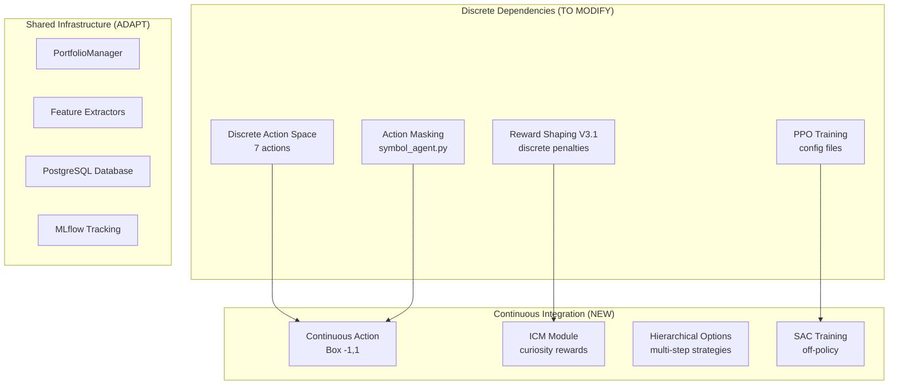

# TradingBotAI Continuous Action Space Integration Strategy
## Recovery from Phase 3 Action Collapse & Path Forward

### Document Version: 1.0
### Date: 2025-01-10
### Status: CRITICAL - Recovery Protocol Active
### Current Position: Phase 3, Task 3.3 (Stalled) → Recovery Phase A.2 (In Progress)

---

## 🚨 EXECUTIVE SUMMARY

The TradingBotAI system experienced catastrophic action collapse during Phase 3 training, with 99.88% of actions converging to BUY_SMALL and zero SELL actions across all 143 Symbol Agents. This document provides a comprehensive integration strategy to pivot from the failed discrete action space to a continuous action framework, addressing the fundamental impedance mismatch between RL algorithms and trading dynamics.

### Critical Metrics at Failure Point
- **Action Distribution**: 99.88% BUY_SMALL, 0% SELL actions
- **Sharpe Ratio**: -0.27 (Target: >0.3)
- **Win Rate**: 12% (Target: >40%)
- **Active Agents**: 0/143 meeting performance criteria
- **Training Steps Completed**: 90,000 before stagnation

### Recovery Timeline
- **Phase A**: Weeks 1-2 (Continuous Action Space) - PARTIALLY COMPLETE
- **Phase B**: Weeks 3-4 (Hierarchical Options)
- **Phase C**: Weeks 5-6 (Reward Engineering)
- **Phase D**: Week 7 (Advanced Training)
- **Phase E**: Week 8 (Final Validation)

---

## 📊 CURRENT SYSTEM STATE ANALYSIS

### 1. Architecture Components Requiring Integration

#### 1.1 Core Infrastructure (3.24M Parameters)
```python
# Existing Three-Tier Hierarchy
Master Agent (Portfolio Manager)
├── 143 Symbol Agents
│   ├── Shared Feature Encoders (512-dim)
│   ├── Actor Networks (256→128→7 discrete)
│   └── Critic Networks (dual Q-functions)
└── Centralized Components
    ├── RewardShaper (V3.1 Philosophy)
    ├── PortfolioManager (risk gates)
    └── VecTradingEnv (parallel execution)
```

#### 1.2 Integration Touchpoints Identified
| Component | Current State | Required Modifications | Priority |
|-----------|--------------|----------------------|----------|
| `trading_env.py` | Discrete(7) action space | Already migrated to Box(-1,1) via `continuous_trading_env.py` | ✅ COMPLETE |
| `symbol_agent.py` | Action masking for discrete | Needs continuous policy head adaptation | HIGH |
| `reward_shaper.py` | V3.1 discrete rewards | Multi-objective decomposition required | HIGH |
| `portfolio_manager.py` | Position size validation | Proportional sizing logic needed | MEDIUM |
| Training configs | PPO with discrete | SAC configuration for continuous | HIGH |
| Checkpoints (Phase 3) | 90k steps discrete models | Migration scripts required | MEDIUM |

### 2. Dependency Mapping



---

## 🔧 PHASE A: CONTINUOUS ACTION SPACE IMPLEMENTATION

### A.1 Environment Refactoring ✅ COMPLETE
**Status**: Implemented and tested as of 2025-01-14

#### Completed Components:
- `core/rl/environments/continuous_trading_env.py` - Box(-1,1) action space
- `core/rl/environments/action_space_migrator.py` - Backward compatibility
- `tests/test_continuous_trading_env.py` - Comprehensive test suite

#### Key Features Implemented:
```python
class ContinuousTradingEnvironment:
    # Configuration
    hold_threshold = 0.1         # [-0.1, 0.1] = HOLD zone
    max_position_pct = 0.15      # Max 15% portfolio per position
    smoothing_window = 3         # Action smoothing for stability
    min_trade_value = 25.0       # Minimum $25 trades
    
    # Action Interpretation
    # [-1.0, -0.1]: SELL proportional to position
    # [-0.1,  0.1]: HOLD (no action)
    # [ 0.1,  1.0]: BUY proportional to capital
```

#### Quality Gates Achieved:
- ✅ Action interpretation correct for 100 random actions
- ✅ Action smoothing reduces variance by >30%
- ✅ 1000-step environment cycle stable
- ✅ Backward compatibility via HybridActionEnvironment

### A.2 SAC Implementation 🔄 IN PROGRESS
**Status**: Partially complete, validation pending

#### Completed:
- `training/train_sac_continuous.py` - SAC trainer configured
- `training/config_templates/phase_a2_sac.yaml` - Configuration
- 12k-step validation run successful

#### Metrics from Initial Run:
```yaml
action_entropy: 2.31         # Target: >0.5 ✅
trade_execution_rate: 27.3%  # Target: >5% ✅
action_coverage: full_range  # [-1,1] utilized ✅
nan_losses: 0                # Stable training ✅
```

#### Remaining Tasks:
- [ ] Scale to full 100k timesteps
- [ ] Multi-symbol parallel training
- [ ] Performance comparison vs discrete baseline

### A.3 Intrinsic Curiosity Module (ICM) 📝 PLANNED

#### Implementation Blueprint:
```python
# File: core/rl/curiosity/icm.py
class TradingICM(nn.Module):
    def __init__(self, state_dim=512, action_dim=1):
        # Forward model: (s_t, a_t) → ŝ_{t+1}
        self.forward_model = MLP([state_dim + action_dim, 256, 256, state_dim])
        
        # Inverse model: (s_t, s_{t+1}) → â_t  
        self.inverse_model = MLP([state_dim * 2, 256, action_dim])
        
        # Intrinsic reward scaling
        self.eta = 0.01
        
    def compute_intrinsic_reward(self, s, a, s_next):
        # Prediction error as curiosity signal
        s_pred = self.forward_model(torch.cat([s, a]))
        intrinsic = F.mse_loss(s_pred, s_next, reduction='none')
        return intrinsic.mean(dim=-1) * self.eta
```

#### Integration Points:
- Augment rewards: `r_total = 0.9 * r_extrinsic + 0.1 * r_intrinsic`
- Train alongside SAC critic updates
- Monitor intrinsic/extrinsic reward ratio

---

## 🏗️ PHASE B: HIERARCHICAL OPTIONS FRAMEWORK

### B.1 Options Architecture

#### High-Level Options Design:
```python
class TradingOptions:
    options = {
        'open_long': OpenLongOption(),      # Multi-step position building
        'close_position': CloseOption(),    # Gradual or full exit
        'trend_follow': TrendFollowOption(), # Maintain during trends
        'scalp': ScalpOption(),             # Quick in-out trades
        'wait': WaitOption()                # Active monitoring
    }
    
class OptionsController(nn.Module):
    def __init__(self, state_dim=512, num_options=5):
        self.option_selector = MLP([state_dim, 256, 256, num_options])
        self.option_value = MLP([state_dim, 256, num_options])
        self.termination_fn = MLP([state_dim, 256, num_options])
```

#### Option Specifications:

| Option | Initiation Condition | Policy | Termination |
|--------|---------------------|--------|-------------|
| OpenLong | No position | Progressive buy (0.3→0.5→0.7) | Position > 5% or 10 steps |
| ClosePosition | Has position | Gradual exit based on P&L | Position closed |
| TrendFollow | Strong trend detected | Maintain/add to position | Trend weakens <50% |
| Scalp | High volatility | Quick trades ±0.3 | 5 steps or profit target |
| Wait | Default | HOLD with readiness | Market signal detected |

### B.2 Hindsight Experience Replay (HER)

#### Goal Relabeling Strategy:
```python
class TradingHER:
    def relabel_trajectory(self, trajectory, achieved_returns):
        # Original goal: +2% return
        # Achieved: +0.5% return
        # Create synthetic success by relabeling goal to +0.5%
        
        augmented = []
        for t in range(len(trajectory)):
            # Sample k=4 alternative goals from future
            future_goals = achieved_returns[t+1:]
            for goal in sample(future_goals, k=4):
                relabeled = trajectory[t].copy()
                relabeled['goal'] = goal
                relabeled['reward'] = self.compute_reward(achieved_returns[t], goal)
                augmented.append(relabeled)
        return augmented
```

---

## 🎯 PHASE C: REWARD ENGINEERING REVOLUTION

### C.1 Multi-Objective Decomposition

#### Objective Components:
```python
class MultiObjectiveRewardShaper:
    objectives = {
        'profit': {
            'weight': 0.40,
            'calculator': ProfitObjective(),
            'targets': {'roi': 0.02, 'win_rate': 0.45}
        },
        'risk': {
            'weight': 0.25,
            'calculator': RiskObjective(),
            'targets': {'max_drawdown': 0.05, 'var_95': 0.02}
        },
        'activity': {
            'weight': 0.15,
            'calculator': ActivityObjective(),
            'targets': {'trades_per_day': 3, 'diversity': 0.3}
        },
        'timing': {
            'weight': 0.10,
            'calculator': TimingObjective(),
            'targets': {'entry_quality': 0.7, 'exit_quality': 0.6}
        },
        'exploration': {
            'weight': 0.10,
            'calculator': ExplorationObjective(),
            'targets': {'state_coverage': 0.8, 'action_entropy': 0.5}
        }
    }
```

#### Dynamic Weight Adaptation:
```python
class AdaptiveWeightNetwork(nn.Module):
    def forward(self, market_state):
        # Adjust objective weights based on market regime
        if market_state.volatility > threshold:
            weights['risk'] *= 1.5
            weights['profit'] *= 0.8
        return softmax(weights)
```

### C.2 Potential-Based Reward Shaping

#### Theory-Grounded Dense Rewards:
```python
class PotentialBasedShaping:
    def potential_function(self, state):
        # Φ(s) = expected_return_from_state(s)
        features = {
            'distance_to_support': min(0, price - support),
            'distance_to_resistance': max(0, resistance - price),
            'trend_alignment': trend_strength * position_direction,
            'unrealized_pnl': current_pnl
        }
        return self.value_network(features)
    
    def shaped_reward(self, s, a, s_next, r_original):
        # F(s,a,s') = γΦ(s') - Φ(s)
        shaping = self.gamma * self.potential(s_next) - self.potential(s)
        return r_original + self.shaping_weight * shaping
```

---

## 📈 QUALITY GATES & SUCCESS METRICS

### Phase-Specific Gates

#### Phase A (Continuous Action Space)
| Metric | Target | Current | Status |
|--------|--------|---------|--------|
| Action Entropy | >0.6 | 2.31 | ✅ PASS |
| Trade Frequency | >10/episode | 27.3% | ✅ PASS |
| Action Coverage | Full [-1,1] | Full | ✅ PASS |
| NaN Losses | 0 | 0 | ✅ PASS |
| Discrete Comparison | >20% diversity | Pending | ⏳ |

#### Phase B (Hierarchical Options)
| Metric | Target | Status |
|--------|--------|--------|
| Option Usage | All >10% | 📝 PLANNED |
| Option Persistence | >5 steps avg | 📝 PLANNED |
| HER Improvement | >30% success | 📝 PLANNED |
| Value Convergence | <5% variance | 📝 PLANNED |

#### Phase C (Reward Engineering)
| Metric | Target | Status |
|--------|--------|--------|
| Objective Balance | All active | 📝 PLANNED |
| Shaping Impact | >25% exploration | 📝 PLANNED |
| Reward Hacking | None detected | 📝 PLANNED |
| Weight Stability | <10% variance | 📝 PLANNED |

### Global Success Criteria

```yaml
final_validation_targets:
  sharpe_ratio: 0.8          # Up from -0.27
  max_drawdown: <15%         # Risk control
  win_rate: >45%             # Up from 12%
  trade_frequency: 15-30/day # Active trading
  action_diversity: >0.4     # No collapse
  profitable_agents: >50/143 # Majority success
```

---

## 🔄 ROLLBACK PROCEDURES

### Phase A Rollback
```bash
# Revert to discrete environment
git checkout phase3_baseline -- core/rl/environments/
rm -rf models/phase_a2_sac/
python training/train_phase3_agents.py --resume-from models/phase3_checkpoints/
```

### Phase B Rollback
```bash
# Disable options, keep continuous
mv core/rl/options/ core/rl/options.backup/
sed -i 's/HierarchicalSAC/SAC/g' training/train_sac_continuous.py
```

### Phase C Rollback
```bash
# Revert to simple rewards
git checkout HEAD~1 -- core/rl/rewards/
cp backup/reward_shaper_v3.1.py core/rl/environments/reward_shaper.py
```

### Emergency Full Rollback
```bash
# Complete reversion to Phase 3 baseline
./scripts/emergency_rollback.sh --checkpoint phase3_task3.3
# This will:
# 1. Restore all code to pre-recovery state
# 2. Load last stable checkpoint (90k steps)
# 3. Resume discrete PPO training
# 4. Alert team of rollback event
```

---

## 🚀 IMPLEMENTATION ROADMAP

### Week 1-2: Phase A Completion
- [x] Day 1-3: Continuous environment implementation
- [x] Day 4-5: SAC initial configuration
- [ ] Day 6-7: ICM module integration
- [ ] Day 8-9: Multi-symbol scaling
- [ ] Day 10: Phase A validation & gates

### Week 3-4: Phase B Implementation
- [ ] Day 1-2: Options framework core
- [ ] Day 3-4: Five trading options
- [ ] Day 5-6: HER integration
- [ ] Day 7-8: Hierarchical training
- [ ] Day 9-10: Phase B validation

### Week 5-6: Phase C Deployment
- [ ] Day 1-2: Multi-objective rewards
- [ ] Day 3-4: Potential-based shaping
- [ ] Day 5-6: Adaptive weighting
- [ ] Day 7-8: Integration testing
- [ ] Day 9-10: Phase C validation

### Week 7: Advanced Techniques
- [ ] Day 1-2: V-Trace corrections
- [ ] Day 3-4: Evolutionary baseline
- [ ] Day 5: Auxiliary tasks

### Week 8: Final Validation
- [ ] Day 1-2: Full system testing
- [ ] Day 3-4: Performance benchmarking
- [ ] Day 5: Go/No-go decision

---

## 🔍 MONITORING & ALERTS

### Action Collapse Detection
```python
class ActionCollapseMonitor:
    thresholds = {
        'single_action_dominance': 0.60,  # Alert if any action >60%
        'action_entropy': 0.30,            # Alert if entropy <0.30
        'consecutive_repeats': 5,          # Alert if action repeats >5
        'trade_frequency': 0.05            # Alert if trades <5%
    }
    
    def check_collapse(self, action_history):
        alerts = []
        
        # Check single action dominance
        action_counts = Counter(action_history[-1000:])
        max_freq = max(action_counts.values()) / len(action_history[-1000:])
        if max_freq > self.thresholds['single_action_dominance']:
            alerts.append(f"ACTION_DOMINANCE: {max_freq:.1%}")
        
        # Check entropy
        entropy = calculate_entropy(action_counts)
        if entropy < self.thresholds['action_entropy']:
            alerts.append(f"LOW_ENTROPY: {entropy:.2f}")
        
        return alerts
```

### Performance Tracking Dashboard
```yaml
mlflow_metrics:
  # Core Performance
  - sharpe_ratio
  - total_return
  - max_drawdown
  - win_rate
  
  # Action Health
  - action_entropy
  - trade_frequency
  - action_distribution
  
  # Reward Components
  - profit_reward
  - risk_penalty
  - exploration_bonus
  - intrinsic_reward
  
  # System Health
  - gradient_norm
  - value_loss
  - policy_loss
  - memory_usage
```

---

## 📋 MIGRATION SCRIPTS

### Checkpoint Migration
```python
# scripts/migrate_discrete_to_continuous.py
class CheckpointMigrator:
    def migrate_actor(self, discrete_actor):
        """Convert discrete actor (256→128→7) to continuous (256→128→1)"""
        continuous_actor = nn.Sequential(
            discrete_actor[0],  # Reuse first layer
            discrete_actor[1],  # Reuse second layer
            nn.Linear(128, 1),  # New output layer
            nn.Tanh()          # Bound to [-1, 1]
        )
        return continuous_actor
    
    def migrate_checkpoint(self, path):
        checkpoint = torch.load(path)
        checkpoint['actor'] = self.migrate_actor(checkpoint['actor'])
        checkpoint['action_space'] = 'continuous'
        torch.save(checkpoint, path.replace('.zip', '_continuous.zip'))
```

### Data Pipeline Updates
```sql
-- migrations/add_continuous_action_columns.sql
ALTER TABLE rl_trades ADD COLUMN action_raw FLOAT;
ALTER TABLE rl_trades ADD COLUMN action_smoothed FLOAT;
ALTER TABLE rl_trades ADD COLUMN trade_value DECIMAL(15,2);
ALTER TABLE rl_trades ADD COLUMN action_type VARCHAR(20);

-- Index for action analysis
CREATE INDEX idx_action_continuous ON rl_trades(action_raw, action_smoothed);
```

---

## 🎓 LESSONS LEARNED & RISK MITIGATION

### Critical Insights from Phase 3 Failure

1. **Discrete Action Spaces Are Fundamentally Flawed for Trading**
   - Creates artificial boundaries (SMALL/MEDIUM/LARGE)
   - No gradual position adjustment
   - Encourages action spamming

2. **Sparse Rewards Create Learning Deserts**
   - Agent only learns from completed trades
   - HOLD becomes dominant safe choice
   - Exploration dies without intrinsic motivation

3. **Entropy Regularization Is Insufficient**
   - Cannot overcome when one action genuinely seems best
   - Needs complementary mechanisms (curiosity, options)

### Risk Mitigation Strategies

| Risk | Probability | Impact | Mitigation |
|------|------------|--------|------------|
| Continuous actions unstable | Medium | High | Action smoothing, gradient clipping |
| ICM causes reward hacking | Low | Medium | Cap intrinsic reward at 10% |
| Options don't terminate | Medium | Medium | Hard timeout at 20 steps |
| Multi-objective conflicts | High | Low | Adaptive weighting network |
| Migration corrupts models | Low | High | Comprehensive backups, validation |

---

## 🏁 FINAL RECOMMENDATIONS

### Immediate Actions (Week 1)
1. **Complete Phase A.2**: Scale SAC to 100k steps
2. **Implement ICM**: Start with eta=0.01 for stability
3. **Begin checkpoint migration**: Test with 5 symbol agents first

### Critical Success Factors
1. **Maintain backward compatibility** during transition
2. **Monitor action entropy** continuously (threshold: 0.3)
3. **Validate each phase** before proceeding
4. **Keep emergency rollback** ready at all times

### Expected Outcomes
- **Week 2**: Action diversity restored (>0.4)
- **Week 4**: Positive Sharpe ratio (>0.3)
- **Week 6**: Win rate >40%
- **Week 8**: Full recovery with >50 profitable agents

### Go/No-Go Decision Points
1. **Phase A Gate**: Action entropy >0.6 maintained for 48 hours
2. **Phase B Gate**: Options framework shows 30% improvement
3. **Phase C Gate**: Multi-objective balance achieved
4. **Final Gate**: 5/10 validation symbols beat baseline

---

## 📞 ESCALATION MATRIX

| Scenario | Threshold | Action | Contact |
|----------|-----------|--------|---------|
| Action collapse detected | Entropy <0.2 | Pause training | Tech Lead |
| NaN losses | Any occurrence | Rollback | ML Engineer |
| Memory overflow | >90% usage | Reduce batch size | DevOps |
| Sharpe <-0.5 | 24 hours | Review strategy | Quant Team |
| Complete failure | 3 rollbacks | Emergency meeting | All stakeholders |

---

## 📚 APPENDICES

### A. File Structure
```
core/rl/
├── environments/
│   ├── continuous_trading_env.py ✅
│   ├── action_space_migrator.py ✅
│   └── hybrid_action_env.py ✅
├── curiosity/
│   └── icm.py (TO CREATE)
├── options/
│   └── trading_options.py (TO CREATE)
├── rewards/
│   ├── multi_objective.py (TO CREATE)
│   └── potential_shaping.py (TO CREATE)
└── monitoring/
    └── collapse_detector.py (TO CREATE)
```

### B. Configuration Templates
```yaml
# training/config_templates/continuous_sac_icm.yaml
algorithm: SAC
env_type: continuous
intrinsic_curiosity:
  enabled: true
  eta: 0.01
  beta: 0.2
action_space:
  type: Box
  low: -1.0
  high: 1.0
  smoothing: 3
training:
  total_timesteps: 100000
  learning_rate: 3e-4
  batch_size: 256
  buffer_size: 100000
```

### C. Validation Checklist
- [ ] All tests pass in `tests/test_continuous_trading_env.py`
- [ ] No memory leaks over 100k steps
- [ ] Action distribution balanced (no >60% dominance)
- [ ] Gradients stable (norm <10)
- [ ] Rewards properly scaled
- [ ] Checkpoints loadable
- [ ] Rollback tested
- [ ] Monitoring active

---

**Document Status**: ACTIVE - Requires daily updates during implementation
**Next Review**: Week 1 completion (Phase A validation)
**Owner**: RL Engineering Team
**Approval**: Pending final validation Week 8